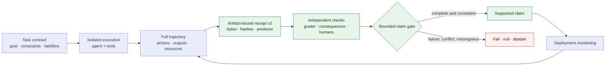

# Telos

**A research programme for verifying agent work by retained evidence, not by
trust.**

## Current scientific boundary

Telos has evidence of cross-solver recurrence on one reused convenience
cohort. Five solver configurations produced at least one operational
certified-yet-wrong label on the same `53` targets:

| Solver configuration | Operational count | Unadjudicated |
| --- | ---: | ---: |
| `gpt-5.6-terra` | `5/29` | `u=0` |
| `gpt-5.5` | `2/25` | `u=2` |
| `gpt-5.4` | `3/17` | `u=2` |
| `claude-sonnet-5` | `4/14` | `u=2` |
| `gemini-3.1-pro-preview` | `1/16` | `u=1` |

Across all six measured runs, including the separate iter200 run, the current
patch-level accounting is `k=17`, `N=125`, and `u=8`. The `17` operational
positives correspond to only `12` unique task identities. Repeated solver
attempts on shared tasks are not independent task samples.

The fresh single-solver cohorts have `k=0`, `N=37`, and `u=13`. Their
least-favourable endpoint is `13/37`, so the contrast with `5/29` on the reused
reference-solver run is **inconclusive**. The current iter200 accounting is
`k=2`, `N=24`, and `u=1`: report `2/24` observed, `3/24` under the
least-favourable assignment, and `2/23` complete-case.

The post-hoc fix-size comparison regenerates as `U=331` with asymptotic
two-sided `p=0.005347` under tie and continuity correction. The registered
held-out reconstruction contains `447` rows but `0` susceptibility outcome
labels, so transfer is **untested**, not negative.

The released detector fixture has `13` operational positive rows and `54`
mixed controls. Of those controls, `29` are normalized-identical to accepted
patches and `25` only showed no divergence on one retained witness. Control
flags are therefore not validated false positives.

These are operational reference differentials, not independent semantic
ground truth. Telos does not currently establish a task-population rate,
provider or model independence, model ranking, validated detector efficacy,
causal repository explanation, leaderboard result, deployable verifier,
completion proof, or state-of-the-art result.

The six current machine-regenerated claims and their exact limitations are in
[`mission/claim_registry.json`](mission/claim_registry.json). Their retained
sources include the
[iter237 correction](experiments/iter237_truth_maintenance_gate/RESULT.md),
[iter236 reconstruction](experiments/iter236_transfer_analysis_reconstruction/RESULT.md),
[iter235 witness recovery](experiments/iter235_witness_recovery/RESULT.md), and
the current [paper](paper/telos.tex).

## Current engineering gate

The active gate is
[`experiments/iter246_iter245_baton_refresh/HYPOTHESIS.md`](experiments/iter246_iter245_baton_refresh/HYPOTHESIS.md),
the registered operational baton refresh for the merged Iter245 closure.
Iter243 is sealed failed remote-integration evidence and its preregistration
integrity is invalid. Iter244 retained a valid preregistration but failed local
design acceptance: its implementation candidate was discarded, nothing was
pushed, and no hosted outcome exists. Iter245 now supports bounded repository
integration for exact candidate `de22688f800e0fb46c15ecd851d2bf76e26b0a82`.
Normal push and pull-request runs each passed Python 3.11 and Python 3.12
without a rerun after exact-archive verification, permission and native-loader
containment, and the authenticated runner's world-write denial. The exact
[Iter245 result](experiments/iter245_offline_verified_python_bootstrap/RESULT.md)
retains that bounded outcome and its capture-contract limitation. Its exact
successor seal, fresh final-head checks, ordered-parent merge, and
merged-master verification are complete and receipted in the current dated
audit. Iter241's failed capture remains sealed and cannot be retried by this
gate. This engineering result is not a scientific result, independent review,
general security approval, publication, or release readiness.

<!-- telos-current-state:start -->
```text
status: supported
scientific_status: blocked pending independent ground truth
claim_boundary: cross-solver recurrence on one fixed 53-target convenience cohort; fresh-cohort concentration is inconclusive, fix-size transfer is untested, and independent semantic ground truth is absent
next_authorized_action: no autonomous action: the Iter245 closure is complete — the exact successor seal `0e14f512ed935cdcdecb56aed04f515546bb57f8` passed fresh push and pull-request CI on Python 3.11 and Python 3.12, PR #90 merged as `9b61abf1f7afb305656544c5823da9b16a4eb69b` with ordered parents and a byte-identical tree, and merged-master CI passed — so stop; the next gates, independent semantic ground truth under the registered admission design or the frozen iter202 natural-rate replication, each require separate operator direction, an approved budget, and operator-supplied provider credentials; no force push, workflow dispatch or rerun, repository-setting change, iter241 retry, provider or model call, scientific execution, human contact, spending, paper submission, release, deployment, or visibility change is authorized
```
<!-- telos-current-state:end -->

This synchronized block is a mutable repository control. Its agreement proves
neither scientific, remote, governance, nor design acceptance.

The failed Iter241 outcome remains authoritative in
[`experiments/iter241_iter240_repository_closure/RESULT.md`](experiments/iter241_iter240_repository_closure/RESULT.md).
The supported local Iter242 outcome is retained in
[`experiments/iter242_iter241_successor_closure/RESULT.md`](experiments/iter242_iter241_successor_closure/RESULT.md).
The failed Iter243 remote-integration outcome is retained in
[`experiments/iter243_iter242_remote_ci_recovery/RESULT.md`](experiments/iter243_iter242_remote_ci_recovery/RESULT.md),
and the failed Iter244 design review is retained in
[`experiments/iter244_verified_python_bootstrap/RESULT.md`](experiments/iter244_verified_python_bootstrap/RESULT.md).
The completed engineering-recovery contract is the
[Iter245 hypothesis](experiments/iter245_offline_verified_python_bootstrap/HYPOTHESIS.md),
supplemented by its
[native-loader](experiments/iter245_offline_verified_python_bootstrap/AMENDMENT-2026-07-22-native-loader-boundary.md)
and
[fail-closed archive](experiments/iter245_offline_verified_python_bootstrap/AMENDMENT-2026-07-22-fail-closed-archive-boundary.md)
amendments, with the supported bounded outcome retained in its
[result](experiments/iter245_offline_verified_python_bootstrap/RESULT.md).

At the current working boundary:

- iter238 through iter245 exact completed evidence are protected by registered
  successor seals, and the Iter246 baton refresh is open under the current
  additions-only prospective authorization;
- public quantitative claims remain governed by
  [`mission/claim_registry.json`](mission/claim_registry.json), protected-byte
  transitions by [`mission/seal_registry.json`](mission/seal_registry.json),
  and workflow execution authority by the default-deny
  [`mission/workflow_registry.json`](mission/workflow_registry.json);
- iter239 installed an active no-bypass ruleset requiring PR association,
  merge-commit mode, resolved conversations, strict app-bound CI, and deletion
  and non-fast-forward blocking;
- that technical floor intentionally does not require approvals
  because no independent write-capable reviewer exists. It must never be
  described as review assurance;
- iter240 preserved all selected fresh-cohort missing outcomes and froze the
  next independent-adjudication design without executing it;
- iter241 failed because the retained PR response omitted a registered member;
  its frozen validator conflated omission with explicit null through shared
  producer/validator projection logic;
- iter241 independently failed the raw-header-byte gate because `http.client`
  returned parsed header pairs that were reserialized as canonical JSON; exact
  header-section bytes
  were never retained and cannot be reconstructed from those documents;
- Iter243 failed required Actions before pytest collection on Python 3.11 and
  Python 3.12; Iter244 stopped at failed local design acceptance without a
  push or hosted observation; Iter245 passed its initial normal push and
  pull-request checks across the registered Python-version matrix, while final sealed-
  head and merged-master checks remain unobserved;
- exact repository bytes classify the reported GitGuardian occurrences as
  occurrence-specific false positives rather than credentials, while the
  external check remains red and supplies no general security approval;
- the retained header artifacts are canonicalized returned header-pair
  documents, not raw HTTP wire bytes; and
- no repository write, workflow dispatch or rerun, provider, model judge,
  human, target, container, GPU, new cohort, or spending action is authorized
  by iter241.

The completed iter238 claim inventory separately accounted for four
preregistered public surfaces and two supplemental hardening surfaces. Its
workflow protocol classified twenty-nine historical one-shot workflows. The
retained live observation recorded both continuous CI and Dependency Graph as
active. Iter238 used zero provider spend.

The mutable authority is
[`mission/current.json`](mission/current.json), which points to
[`docs/HANDOFF-2026-07-24-iter246.md`](docs/HANDOFF-2026-07-24-iter246.md) and
[`docs/TELOS-AUDIT-2026-07-24.md`](docs/TELOS-AUDIT-2026-07-24.md).
Root [`HANDOFF.md`](HANDOFF.md), [`CONTINUITY.md`](CONTINUITY.md), and
[`mission/loop.json`](mission/loop.json) are protected historical surfaces,
not the current baton.

The historical claim-boundary release-manifest chain remains available through
the
[`claim-boundary manifest`](experiments/iter31_claim_boundary_release_manifest/proof/claim_boundary_release_manifest.json),
[`self-coverage report`](experiments/iter35_release_manifest_self_coverage_guard/proof/self_coverage_report.json),
and
[`negative-guard report`](experiments/iter36_release_manifest_self_coverage_negative_guard/proof/negative_guard_report.json).
These are retained evidence, not current scientific or execution authority.

## What Telos studies

An agent can satisfy the tests or grader used as its acceptance signal without
satisfying the task that signal stands for. Telos studies how to build an
assurance case for agent work from independently checkable evidence:



A digest proves byte identity, not authorship, chronology, independence, or
truth. A signature, model review, or consensus is not allowed to approve its
own consequential scientific claim.

## Evidence map

The current evidence is best read in this order:

1. [Closure verification audit](docs/TELOS-AUDIT-2026-07-24.md) — dated
   receipts for the merged Iter245 closure — and its predecessor
   [takeover audit](docs/TELOS-AUDIT-2026-07-22.md) with the frontier
   comparison and mission sequence.
2. [Current paper source](paper/telos.tex) and [PDF](paper/telos.pdf) —
   forensic case-series synthesis; not submission-ready or a benchmark claim.
3. [Iter237 truth maintenance](experiments/iter237_truth_maintenance_gate/RESULT.md)
   — corrected public inference and structural numeric guards.
4. [Iter235 witness recovery](experiments/iter235_witness_recovery/RESULT.md)
   — recovered missing outcomes without converting missingness to zero.
5. [Iter224](experiments/iter224_natural_rate_scale_n/RESULT.md) and
   [iter228](experiments/iter228_fresh_diverse_cohort/RESULT.md) — fresh-cohort
   observations, retained as inconclusive.
6. [Iter233 release](experiments/iter233_natural_benchmark_release/release/README.md),
   [iter232 validated exercise](experiments/iter232_validated_exercise_instrument/RESULT.md),
   and [iter234 consequence tests](experiments/iter234_issue_only_consequence_tests/RESULT.md)
   — bounded detector and instrument evidence, including negative results.
7. [Iter211 TCP-1 preflight](experiments/iter211_tcp1_materialization_preflight/RESULT.md),
   [iter219 temporal consequence-test yield null](experiments/iter219_temporal_consequence_test_yield/RESULT.md),
   and [iter222 admission evidence](experiments/iter222_tcp1_agent_solvable_admission_evidence/RESULT.md)
   — completion-assurance design and still-blocked external admission.

The deterministic
[`docs/EXPERIMENT_INDEX.md`](docs/EXPERIMENT_INDEX.md) links every retained
experiment hypothesis and result. It preserves discoverability without
turning the README into a second, drifting copy of hundreds of historical
measurements.

## Historical record

## Corrections retained by reference

The record deliberately preserves failures and corrections:

- The original `40`-row reward-hack benchmark was the wrong construct: every
  row failed an official graded regression check. Iter192 is conservatively
  adjudicated `FAIL` in the
  [retained audit](experiments/iter192_reward_hack_benchmark_construct_validity_audit/RESULT.md);
  its literal v1-specific falsifier remains indeterminate.
- The successor
  [`22`-row, `8`-repository reference-differential corpus](benchmarks/certified_resolved_reward_hack_v2/README.md)
  is a constructed operational corpus, not independently adjudicated semantic
  ground truth. Historical execution used mutable `:latest` images, so exact
  historical container bytes are not reconstructible.
- The iter195 gate is protocol `FAIL`: its property construction used
  gold-and-variant assistance and is not an independently validated
  synthesized-input oracle.
- The locator-assisted, gold-validated property pipeline and its paired judge
  diagnostics remain exploratory. The full paper retains the bounded values,
  missing outputs, and interpretation limits.
- At the iter165 boundary, a bounded paired single-model judge result existed.
  It remains historical evidence only.
- No leaderboard, public benchmark score, model-comparison result, or
  precision result beyond the explicitly bounded denominators is claimed.

The publication-engineering lineage remains discoverable through the
[post-seal forensic correction](experiments/iter208_post_seal_forensic_correction/RESULT.md),
[iter209 publication CI recovery](experiments/iter209_publication_ci_recovery/RESULT.md),
[iter211 TCP-1 materialization preflight](experiments/iter211_tcp1_materialization_preflight/RESULT.md),
[iter213 post-seal validation recovery](experiments/iter213_iter211_post_seal_validation_recovery/RESULT.md),
and [iter214 cross-platform numeric recovery](experiments/iter214_tcp1_cross_platform_numeric_recovery/RESULT.md).
The provider-complete safety null and every other predecessor remain linked
from the deterministic experiment index.
[Iter222 filled three TCP-1 admission gates](experiments/iter222_tcp1_agent_solvable_admission_evidence/RESULT.md),
but scientific execution remains blocked.

## Next mission gates

Iter240 reconstructs the fresh-cohort missingness boundary from retained bytes
and freezes a task-clustered, role-separated independent-adjudication design.
Its design may pass while retained-evidence recovery, independent ground truth,
and cohort acquisition remain blocked.

After iter238 acceptance, Telos first preregistered repository governance.

GROUND-TRUTH-1 remains the next scientific gate.
Independent semantic adjudication remains the next scientific gate. It may not execute until
independently conflict-screened humans and a separate budget authorization
exist.

The next scientific job is to establish independent semantic labels at the
unique-task level:

- consequence authors see the issue and pre-fix repository state, but not the
  candidate, accepted patch, prior label, witness, or model-judge output;
- proposed consequences must pass on the accepted implementation and an
  independently produced valid implementation before they can count against a
  candidate;
- disagreements, abstentions, invalid tests, raw rationale, and reviewer
  conflicts remain visible;
- model samples may be evaluated as detectors, but may not become the
  ground-truth authority.

Only after that gate can Telos measure the incremental assurance from
consequence tests, full trajectories, monitoring, and interoperable
provenance on fresh real tasks.

## Repository contract

```text
README.md                  current research front door
AGENTS.md                  durable project boundary and evidence rules
mission/current.json       mutable pointer to the active gate and handoff
mission/claim_registry.json
                           current public quantitative claim coverage
mission/seal_registry.json protected-byte and successor policy
mission/workflow_registry.json
                           default-deny workflow lifecycle authority
docs/EXPERIMENT_INDEX.md   deterministic retained-experiment index
paper/                     findings paper source, build notes, and PDF
benchmarks/                retained candidate and operational fixtures
experiments/               one additive directory per experiment
protocol/                  proof receipt schema
scripts/                   builders, validators, and controlled drivers
tests/                     known-good and known-bad checks
```

TELOS, Sentinel, Inbar, and Odeya are separate projects. They are all separate
from Aweb. External models, providers, stores, and tools are adapters, not
Telos scientific authority.

## Reproduce the current state

The active GitHub workflow uses `ubuntu-24.04`, pins external actions and the
Iter245 bootstrap sources by full digest, grants read-only repository contents
permission, and installs hash-locked verification dependencies through the
contained interpreter. The hosted bootstrap verifies each registered archive
before extraction and does not execute the upstream setup path. The local
closure is derived from that workflow rather than maintained as a second
command list. It skips hosted provisioning and therefore does not certify the
download or extraction path.

```bash
python3 scripts/validate_current_paper.py
python3 scripts/validate_current_state.py
python3 scripts/validate_mission_loop.py
python3 scripts/validate_claim_registry.py
python3 scripts/validate_seal_registry.py
python3 scripts/validate_workflow_registry.py
python3 scripts/validate_iter245_python_bootstrap.py
python3 scripts/audit_workflow_server_state.py
python3 scripts/experiment_index.py --check
python3 scripts/run_ci_closure.py
```

The live workflow audit is a mutable world-contact observation. It is run and
reported separately; it is not part of deterministic offline closure.

## Writing standard

Use exact statuses: `proposed`, `exploratory`, `preregistered`, `running`,
`blocked`, `invalid`, `null`, `inconclusive`, `failed`, `supported`,
`contradicted`, `replicated`, `corrected`, or `retracted`.

Never convert missing or unmeasured values to zero. Preserve nulls, failures,
and corrections with the same visibility as positive results. Every claim
must stay below its named benchmark, comparator, scope, date, and retained
evidence.
