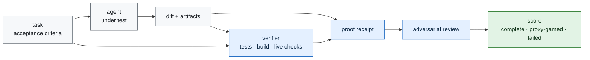

# Telos

**A research program for verifying autonomous agent work by evidence, not by trust.**

No model result is claimed yet. The repository begins with a completed target survey:
[`experiments/iter00_target_survey`](experiments/iter00_target_survey/RESULT.md), which selected a
hybrid Telos overlay on public software-agent tasks.

The question is narrow and testable:

> When an AI agent says a long-horizon task is done, can an external protocol prove that the real
> objective was completed, that the agent did not merely satisfy the visible proxy, and that it
> stopped at the correct boundary?

The target is not a better chat transcript. The target is a receipt-bearing completion protocol:
tests when code changed, typecheck/build when applicable, diff-scope checks, live-domain checks
when production behavior changed, artifact hashes, stated acceptance criteria, named falsifiers,
and an adversarial review pass.

## Honest Status

- Repository scaffold: active.
- First gate: target survey published as `HYBRID_OVERLAY_SELECTED`.
- Public slice: selected in
  [`experiments/iter02_public_task_slice`](experiments/iter02_public_task_slice/RESULT.md).
- CodeClash smoke: passed in
  [`experiments/iter03_codeclash_smoke`](experiments/iter03_codeclash_smoke/RESULT.md).
- Agent-behavior slice: selected in
  [`experiments/iter04_agent_behavior_slice`](experiments/iter04_agent_behavior_slice/RESULT.md).
- Agent-behavior smoke: passed in
  [`experiments/iter05_agent_behavior_smoke`](experiments/iter05_agent_behavior_smoke/RESULT.md).
- Deterministic edit slice: selected in
  [`experiments/iter06_deterministic_edit_slice`](experiments/iter06_deterministic_edit_slice/RESULT.md).
- Deterministic edit smoke: passed in
  [`experiments/iter07_deterministic_edit_smoke`](experiments/iter07_deterministic_edit_smoke/RESULT.md).
- Provider-model pilot slice: selected in
  [`experiments/iter08_provider_model_pilot_slice`](experiments/iter08_provider_model_pilot_slice/RESULT.md).
- Provider-model pilot smoke: blocked before spend in
  [`experiments/iter09_provider_model_pilot_smoke`](experiments/iter09_provider_model_pilot_smoke/RESULT.md).
- Provider auth recovery: passed in
  [`experiments/iter10_provider_auth_recovery`](experiments/iter10_provider_auth_recovery/RESULT.md).
- Provider-model pilot retry: blocked in
  [`experiments/iter11_provider_model_pilot_retry`](experiments/iter11_provider_model_pilot_retry/RESULT.md).
- Vertex model access recovery: passed in
  [`experiments/iter12_vertex_model_access_recovery`](experiments/iter12_vertex_model_access_recovery/RESULT.md).
- Provider-model pilot retry after access recovery: passed in
  [`experiments/iter13_provider_model_pilot_retry_after_access_recovery`](experiments/iter13_provider_model_pilot_retry_after_access_recovery/RESULT.md).
- Provider diff quality review: passed in
  [`experiments/iter14_provider_diff_quality_review`](experiments/iter14_provider_diff_quality_review/RESULT.md).
- Provider strict diff rerun: failed the clean diff-quality bar in
  [`experiments/iter15_provider_strict_diff_rerun`](experiments/iter15_provider_strict_diff_rerun/RESULT.md).
- Provider workspace hygiene control: passed the helper-residue bar with a recorded style caveat in
  [`experiments/iter16_provider_workspace_hygiene_control`](experiments/iter16_provider_workspace_hygiene_control/RESULT.md).
- Provider lint hygiene control: passed the clean workspace-and-lint bar in
  [`experiments/iter17_provider_lint_hygiene_control`](experiments/iter17_provider_lint_hygiene_control/RESULT.md).
- Provider behavior depth control: passed with a process caveat in
  [`experiments/iter18_provider_behavior_depth_control`](experiments/iter18_provider_behavior_depth_control/RESULT.md).
- Provider final inspection control: passed the final inspection bar in
  [`experiments/iter19_provider_final_inspection_control`](experiments/iter19_provider_final_inspection_control/RESULT.md).
- Behavior semantic verification: passed eight deterministic local safety cases in
  [`experiments/iter20_behavior_semantic_verification`](experiments/iter20_behavior_semantic_verification/RESULT.md).
- Opponent collision control: passed the provider run and twelve semantic safety cases in
  [`experiments/iter21_opponent_collision_control`](experiments/iter21_opponent_collision_control/RESULT.md).
- Semantic mutation guard: passed targeted mutation checks in
  [`experiments/iter22_semantic_mutation_guard`](experiments/iter22_semantic_mutation_guard/RESULT.md).
- Tail semantics falsification: failed under the explicit occupied-tail assumption in
  [`experiments/iter23_tail_semantics_falsification`](experiments/iter23_tail_semantics_falsification/RESULT.md).
- Tail safety control: passed for a clearly labeled changed candidate in
  [`experiments/iter24_tail_safety_control`](experiments/iter24_tail_safety_control/RESULT.md).
- Tail safety mutation guard: failed because the own-tail mutant did not remove the redundant
  self-snake fallback path in
  [`experiments/iter25_tail_safety_mutation_guard`](experiments/iter25_tail_safety_mutation_guard/RESULT.md).
- Own-tail redundancy mutation guard: passed with a compound own-tail mutant in
  [`experiments/iter26_own_tail_redundancy_mutation_guard`](experiments/iter26_own_tail_redundancy_mutation_guard/RESULT.md).
- Semantic claim boundary matrix: passed with original/candidate/failure/verifier rows separated in
  [`experiments/iter27_semantic_claim_boundary_matrix`](experiments/iter27_semantic_claim_boundary_matrix/RESULT.md).
- Public claim surface guard: passed against README/report/next-phase/continuity prose in
  [`experiments/iter28_public_claim_surface_guard`](experiments/iter28_public_claim_surface_guard/RESULT.md).
- Public claim surface negative guard: passed with four generated overclaim fixtures in
  [`experiments/iter29_public_claim_surface_negative_guard`](experiments/iter29_public_claim_surface_negative_guard/RESULT.md).
- Boundary matrix schema guard: passed with five malformed matrix fixtures in
  [`experiments/iter30_boundary_matrix_schema_guard`](experiments/iter30_boundary_matrix_schema_guard/RESULT.md).
- Claim boundary release manifest: passed with a 33-artifact hash-checked proof packet in
  [`experiments/iter31_claim_boundary_release_manifest`](experiments/iter31_claim_boundary_release_manifest/RESULT.md).
- Claim boundary release manifest negative guard: passed with five malformed manifest fixtures in
  [`experiments/iter32_claim_boundary_release_manifest_negative_guard`](experiments/iter32_claim_boundary_release_manifest_negative_guard/RESULT.md).
- Release manifest public sync guard: passed against README/report/next-phase/continuity prose in
  [`experiments/iter33_release_manifest_public_sync_guard`](experiments/iter33_release_manifest_public_sync_guard/RESULT.md).
- Release manifest public sync negative guard: passed with five malformed public-prose fixtures in
  [`experiments/iter34_release_manifest_public_sync_negative_guard`](experiments/iter34_release_manifest_public_sync_negative_guard/RESULT.md).
- Release manifest self-coverage guard: passed with 49 proof artifacts indexed across `iter31`
  through `iter34` in
  [`experiments/iter35_release_manifest_self_coverage_guard`](experiments/iter35_release_manifest_self_coverage_guard/RESULT.md).
- Release manifest self-coverage negative guard: passed with five malformed self-coverage fixtures in
  [`experiments/iter36_release_manifest_self_coverage_negative_guard`](experiments/iter36_release_manifest_self_coverage_negative_guard/RESULT.md).
- Release manifest self-coverage public sync guard: passed against README/report/next-phase/continuity prose in
  [`experiments/iter37_release_manifest_self_coverage_public_sync_guard`](experiments/iter37_release_manifest_self_coverage_public_sync_guard/RESULT.md).
- Release manifest self-coverage public sync negative guard: passed with six malformed public-prose fixtures in
  [`experiments/iter38_release_manifest_self_coverage_public_sync_negative_guard`](experiments/iter38_release_manifest_self_coverage_public_sync_negative_guard/RESULT.md).
- Public task protocol-effect slice: passed with three executable task surfaces, two conditions, and before-data metrics in
  [`experiments/iter39_public_task_protocol_effect_slice`](experiments/iter39_public_task_protocol_effect_slice/RESULT.md).
- Public task protocol-effect execution: blocked before provider execution because runner readiness
  was not established in
  [`experiments/iter40_public_task_protocol_effect_execution`](experiments/iter40_public_task_protocol_effect_execution/RESULT.md).
- Public task protocol-effect runner recovery: passed through three isolated GitHub Actions
  CodeClash runner checks with zero provider spend in
  [`experiments/iter41_public_task_protocol_effect_runner_recovery`](experiments/iter41_public_task_protocol_effect_runner_recovery/RESULT.md).
- Public task protocol-effect execution retry: blocked before provider execution because the
  provider-capable harness, cost capture, and raw-artifact redaction controls were not recovered in
  [`experiments/iter42_public_task_protocol_effect_execution_retry`](experiments/iter42_public_task_protocol_effect_execution_retry/RESULT.md).
- Provider execution harness recovery: passed with a non-GPU ephemeral runner lifecycle probe,
  zero provider model calls, zero provider spend, and zero full task-condition pairs in
  [`experiments/iter43_provider_execution_harness_recovery`](experiments/iter43_provider_execution_harness_recovery/RESULT.md).
- Public task protocol-effect execution after harness recovery: blocked before provider execution
  because the recovered harness still disables full task-condition execution in
  [`experiments/iter44_public_task_protocol_effect_execution_after_harness_recovery`](experiments/iter44_public_task_protocol_effect_execution_after_harness_recovery/RESULT.md).
- Public task-condition executor assembly: passed as a dry-run manifest with six frozen pairs,
  zero provider model calls, zero provider spend, no cloud runner, and full execution still disabled
  in
  [`experiments/iter45_public_task_condition_executor_assembly`](experiments/iter45_public_task_condition_executor_assembly/RESULT.md).
- Public task protocol-effect execution with assembled executor: blocked before provider execution
  because provider overlays were not bound into pair commands and the recovered harness still
  disabled full task-condition execution in
  [`experiments/iter46_public_task_protocol_effect_execution_with_assembled_executor`](experiments/iter46_public_task_protocol_effect_execution_with_assembled_executor/RESULT.md).
- Provider task-condition command binding recovery: blocked and narrowed the plan to two
  provider-ready BattleSnake pairs while keeping four incompatible pairs visible in
  [`experiments/iter47_provider_task_condition_command_binding_recovery`](experiments/iter47_provider_task_condition_command_binding_recovery/RESULT.md).
- Provider-compatible protocol-effect slice refreeze: passed with two selected BattleSnake
  provider-compatible pairs, four excluded historical pairs, zero provider calls, zero spend, no
  cloud runner, no GPU, and no Sentinel resource modification in
  [`experiments/iter48_provider_compatible_protocol_effect_slice_refreeze`](experiments/iter48_provider_compatible_protocol_effect_slice_refreeze/RESULT.md).
- Current gate: provider-compatible protocol-effect execution retry, pre-registered in
  [`experiments/iter49_provider_compatible_protocol_effect_execution_retry`](experiments/iter49_provider_compatible_protocol_effect_execution_retry/HYPOTHESIS.md).
- Benchmark result: none yet.
- Current target: Telos overlay on CodeClash + SWE-bench Verified public software-agent tasks.

Claim-boundary reviewer entry point:
[`experiments/iter31_claim_boundary_release_manifest/proof/claim_boundary_release_manifest.json`](experiments/iter31_claim_boundary_release_manifest/proof/claim_boundary_release_manifest.json).
It indexes the current claim-boundary proof packet and keeps failed/null rows, changed candidates,
and no-claim exclusions visible. It is not a leaderboard, SWE-bench, production, live-domain, or
model-superiority result.

Self-coverage reviewer entry points:
[`experiments/iter35_release_manifest_self_coverage_guard/proof/self_coverage_report.json`](experiments/iter35_release_manifest_self_coverage_guard/proof/self_coverage_report.json)
and
[`experiments/iter36_release_manifest_self_coverage_negative_guard/proof/negative_guard_report.json`](experiments/iter36_release_manifest_self_coverage_negative_guard/proof/negative_guard_report.json).
They account for the release manifest's own self-verification gates and negative fixtures without
changing the claim boundary.

This repo deliberately separates the research line from Sentinel. Sentinel proved a standard:
frozen bars, public baselines, nulls published, raw evidence committed, corrections on the record.
This repo applies that standard to autonomous agent completion.

## The First Number To Freeze

`iter00_target_survey` will score candidate benchmark families against seven criteria:

| criterion | meaning |
|---|---|
| frontier relevance | the problem matches current autonomous-agent failure modes |
| public baseline quality | there is a named benchmark, split, and published score |
| falsifiability | the protocol can fail clearly, before narrative interpretation |
| evidence surface | the task can emit receipts beyond a final answer |
| Aweb fit | Aweb can run and verify it without hidden fleet-scale infrastructure |
| saturation risk | current leaderboards have not made the target uninformative |
| operational cost | the first honest experiment is affordable |

The survey chose one of three actions:

1. Freeze the first public benchmark target.
2. **Freeze a hybrid benchmark built from public tasks plus Telos proof receipts.**
3. Publish a survey null if no candidate clears the bar.

Survey result: [`experiments/iter00_target_survey/RESULT.md`](experiments/iter00_target_survey/RESULT.md).
Receipt dry run: [`experiments/iter01_receipt_dry_run/RESULT.md`](experiments/iter01_receipt_dry_run/RESULT.md).
Public slice: [`experiments/iter02_public_task_slice/RESULT.md`](experiments/iter02_public_task_slice/RESULT.md).
CodeClash smoke: [`experiments/iter03_codeclash_smoke/RESULT.md`](experiments/iter03_codeclash_smoke/RESULT.md).
Agent-behavior slice: [`experiments/iter04_agent_behavior_slice/RESULT.md`](experiments/iter04_agent_behavior_slice/RESULT.md).
Agent-behavior smoke: [`experiments/iter05_agent_behavior_smoke/RESULT.md`](experiments/iter05_agent_behavior_smoke/RESULT.md).
Deterministic edit slice: [`experiments/iter06_deterministic_edit_slice/RESULT.md`](experiments/iter06_deterministic_edit_slice/RESULT.md).
Deterministic edit smoke: [`experiments/iter07_deterministic_edit_smoke/RESULT.md`](experiments/iter07_deterministic_edit_smoke/RESULT.md).
Provider-model pilot slice: [`experiments/iter08_provider_model_pilot_slice/RESULT.md`](experiments/iter08_provider_model_pilot_slice/RESULT.md).
Provider-model pilot smoke: [`experiments/iter09_provider_model_pilot_smoke/RESULT.md`](experiments/iter09_provider_model_pilot_smoke/RESULT.md).
Provider auth recovery: [`experiments/iter10_provider_auth_recovery/RESULT.md`](experiments/iter10_provider_auth_recovery/RESULT.md).
Provider-model pilot retry: [`experiments/iter11_provider_model_pilot_retry/RESULT.md`](experiments/iter11_provider_model_pilot_retry/RESULT.md).
Vertex model access recovery: [`experiments/iter12_vertex_model_access_recovery/RESULT.md`](experiments/iter12_vertex_model_access_recovery/RESULT.md).
Provider-model pilot retry after access recovery: [`experiments/iter13_provider_model_pilot_retry_after_access_recovery/RESULT.md`](experiments/iter13_provider_model_pilot_retry_after_access_recovery/RESULT.md).
Provider diff quality review: [`experiments/iter14_provider_diff_quality_review/RESULT.md`](experiments/iter14_provider_diff_quality_review/RESULT.md).
Provider strict diff rerun: [`experiments/iter15_provider_strict_diff_rerun/RESULT.md`](experiments/iter15_provider_strict_diff_rerun/RESULT.md).
Provider workspace hygiene control: [`experiments/iter16_provider_workspace_hygiene_control/RESULT.md`](experiments/iter16_provider_workspace_hygiene_control/RESULT.md).
Provider lint hygiene control: [`experiments/iter17_provider_lint_hygiene_control/RESULT.md`](experiments/iter17_provider_lint_hygiene_control/RESULT.md).
Provider behavior depth control: [`experiments/iter18_provider_behavior_depth_control/RESULT.md`](experiments/iter18_provider_behavior_depth_control/RESULT.md).
Provider final inspection control: [`experiments/iter19_provider_final_inspection_control/RESULT.md`](experiments/iter19_provider_final_inspection_control/RESULT.md).
Behavior semantic verification: [`experiments/iter20_behavior_semantic_verification/RESULT.md`](experiments/iter20_behavior_semantic_verification/RESULT.md).
Opponent collision control: [`experiments/iter21_opponent_collision_control/RESULT.md`](experiments/iter21_opponent_collision_control/RESULT.md).
Semantic mutation guard: [`experiments/iter22_semantic_mutation_guard/RESULT.md`](experiments/iter22_semantic_mutation_guard/RESULT.md).
Tail semantics falsification: [`experiments/iter23_tail_semantics_falsification/RESULT.md`](experiments/iter23_tail_semantics_falsification/RESULT.md).
Tail safety control: [`experiments/iter24_tail_safety_control/RESULT.md`](experiments/iter24_tail_safety_control/RESULT.md).
Tail safety mutation guard: [`experiments/iter25_tail_safety_mutation_guard/RESULT.md`](experiments/iter25_tail_safety_mutation_guard/RESULT.md).
Own-tail redundancy mutation guard: [`experiments/iter26_own_tail_redundancy_mutation_guard/RESULT.md`](experiments/iter26_own_tail_redundancy_mutation_guard/RESULT.md).
Semantic claim boundary matrix: [`experiments/iter27_semantic_claim_boundary_matrix/RESULT.md`](experiments/iter27_semantic_claim_boundary_matrix/RESULT.md).
Public claim surface guard: [`experiments/iter28_public_claim_surface_guard/RESULT.md`](experiments/iter28_public_claim_surface_guard/RESULT.md).
Public claim surface negative guard: [`experiments/iter29_public_claim_surface_negative_guard/RESULT.md`](experiments/iter29_public_claim_surface_negative_guard/RESULT.md).
Boundary matrix schema guard: [`experiments/iter30_boundary_matrix_schema_guard/RESULT.md`](experiments/iter30_boundary_matrix_schema_guard/RESULT.md).
Claim boundary release manifest: [`experiments/iter31_claim_boundary_release_manifest/RESULT.md`](experiments/iter31_claim_boundary_release_manifest/RESULT.md).
Claim boundary release manifest negative guard: [`experiments/iter32_claim_boundary_release_manifest_negative_guard/RESULT.md`](experiments/iter32_claim_boundary_release_manifest_negative_guard/RESULT.md).
Release manifest public sync guard: [`experiments/iter33_release_manifest_public_sync_guard/RESULT.md`](experiments/iter33_release_manifest_public_sync_guard/RESULT.md).
Release manifest public sync negative guard: [`experiments/iter34_release_manifest_public_sync_negative_guard/RESULT.md`](experiments/iter34_release_manifest_public_sync_negative_guard/RESULT.md).
Release manifest self-coverage guard: [`experiments/iter35_release_manifest_self_coverage_guard/RESULT.md`](experiments/iter35_release_manifest_self_coverage_guard/RESULT.md).
Release manifest self-coverage negative guard: [`experiments/iter36_release_manifest_self_coverage_negative_guard/RESULT.md`](experiments/iter36_release_manifest_self_coverage_negative_guard/RESULT.md).
Release manifest self-coverage public sync guard: [`experiments/iter37_release_manifest_self_coverage_public_sync_guard/RESULT.md`](experiments/iter37_release_manifest_self_coverage_public_sync_guard/RESULT.md).
Release manifest self-coverage public sync negative guard: [`experiments/iter38_release_manifest_self_coverage_public_sync_negative_guard/RESULT.md`](experiments/iter38_release_manifest_self_coverage_public_sync_negative_guard/RESULT.md).
Public task protocol-effect slice: [`experiments/iter39_public_task_protocol_effect_slice/RESULT.md`](experiments/iter39_public_task_protocol_effect_slice/RESULT.md).
Public task protocol-effect execution: [`experiments/iter40_public_task_protocol_effect_execution/RESULT.md`](experiments/iter40_public_task_protocol_effect_execution/RESULT.md).
Public task protocol-effect runner recovery: [`experiments/iter41_public_task_protocol_effect_runner_recovery/RESULT.md`](experiments/iter41_public_task_protocol_effect_runner_recovery/RESULT.md).
Public task protocol-effect execution retry: [`experiments/iter42_public_task_protocol_effect_execution_retry/RESULT.md`](experiments/iter42_public_task_protocol_effect_execution_retry/RESULT.md).
Provider execution harness recovery: [`experiments/iter43_provider_execution_harness_recovery/RESULT.md`](experiments/iter43_provider_execution_harness_recovery/RESULT.md).
Public task protocol-effect execution after harness recovery: [`experiments/iter44_public_task_protocol_effect_execution_after_harness_recovery/RESULT.md`](experiments/iter44_public_task_protocol_effect_execution_after_harness_recovery/RESULT.md).
Public task-condition executor assembly: [`experiments/iter45_public_task_condition_executor_assembly/RESULT.md`](experiments/iter45_public_task_condition_executor_assembly/RESULT.md).
Public task protocol-effect execution with assembled executor: [`experiments/iter46_public_task_protocol_effect_execution_with_assembled_executor/RESULT.md`](experiments/iter46_public_task_protocol_effect_execution_with_assembled_executor/RESULT.md).
Provider task-condition command binding recovery: [`experiments/iter47_provider_task_condition_command_binding_recovery/RESULT.md`](experiments/iter47_provider_task_condition_command_binding_recovery/RESULT.md).
Provider-compatible protocol-effect slice refreeze: [`experiments/iter48_provider_compatible_protocol_effect_slice_refreeze/RESULT.md`](experiments/iter48_provider_compatible_protocol_effect_slice_refreeze/RESULT.md).
Provider-compatible protocol-effect execution retry: [`experiments/iter49_provider_compatible_protocol_effect_execution_retry/HYPOTHESIS.md`](experiments/iter49_provider_compatible_protocol_effect_execution_retry/HYPOTHESIS.md).

## Current Evidence Arc


## Candidate Target Families

The initial candidates are documented in [`benchmarks/CANDIDATES.md`](benchmarks/CANDIDATES.md):

- coding-agent completion: SWE-bench Verified, CodeClash, Terminal-Bench-style tasks
- AI R&D agents: METR RE-Bench-style research engineering tasks
- tool-using service agents: tau-bench-style policy and database-state tasks
- adversarial tool agents: AgentDojo-style utility/security tradeoffs
- custom Telos overlay: public tasks with receipt requirements added around them

The target was not chosen by taste. It was chosen by the frozen survey.

## Architecture



Full design: [`docs/ARCHITECTURE.md`](docs/ARCHITECTURE.md).
Presentation standard: [`docs/PRESENTATION.md`](docs/PRESENTATION.md).
Learning engine: [`docs/LEARNING_ENGINE.md`](docs/LEARNING_ENGINE.md).
Mission loop: [`docs/MISSION_LOOP.md`](docs/MISSION_LOOP.md).

## Repository Map

```text
README.md                  research front door and live status
PREREGISTRATION.md         frozen first-stage target-selection protocol
CONTINUITY.md              operator invariants and handoff discipline
HANDOFF.md                 dynamic snapshot generated by scripts/make_handoff.py
telos/                     receipt validation and target scorecard primitives
benchmarks/                candidate benchmark registry
docs/                      architecture, related work, report, next phase
experiments/               one folder per pre-registered experiment
mission/                   machine-readable mission loop contract
protocol/                  proof receipt schema
scripts/                   validation and handoff tooling
tests/                     repository and protocol tests
```

## Reproduce The Current State

```bash
ruff check .
pytest -q
python3 scripts/validate_docs.py
python3 scripts/validate_mission_loop.py
python3 scripts/validate_target_survey.py
python3 scripts/validate_public_slice.py
python3 scripts/validate_agent_behavior_slice.py
python3 scripts/validate_deterministic_edit_slice.py
python3 scripts/validate_provider_model_pilot_slice.py
python3 scripts/validate_receipts.py experiments/iter01_receipt_dry_run/proof
python3 scripts/validate_receipts.py experiments/iter03_codeclash_smoke/proof
python3 scripts/audit_codeclash_smoke.py
python3 scripts/validate_receipts.py experiments/iter05_agent_behavior_smoke/proof
python3 scripts/audit_agent_behavior_smoke.py
python3 scripts/validate_receipts.py experiments/iter07_deterministic_edit_smoke/proof
python3 scripts/audit_deterministic_edit_smoke.py
python3 scripts/validate_receipts.py experiments/iter09_provider_model_pilot_smoke/proof
python3 scripts/audit_provider_model_pilot_smoke.py
python3 scripts/validate_receipts.py experiments/iter10_provider_auth_recovery/proof
python3 scripts/audit_provider_auth_recovery.py
python3 scripts/validate_receipts.py experiments/iter11_provider_model_pilot_retry/proof
python3 scripts/audit_provider_model_pilot_retry.py
python3 scripts/validate_receipts.py experiments/iter12_vertex_model_access_recovery/proof
python3 scripts/audit_vertex_model_access_recovery.py
python3 scripts/validate_receipts.py experiments/iter13_provider_model_pilot_retry_after_access_recovery/proof
python3 scripts/audit_provider_model_pilot_after_access.py
python3 scripts/validate_receipts.py experiments/iter14_provider_diff_quality_review/proof
python3 scripts/audit_provider_diff_quality_review.py
python3 scripts/validate_receipts.py experiments/iter15_provider_strict_diff_rerun/proof
python3 scripts/audit_provider_strict_diff_rerun.py
python3 scripts/validate_receipts.py experiments/iter16_provider_workspace_hygiene_control/proof
python3 scripts/audit_provider_workspace_hygiene_control.py
python3 scripts/validate_receipts.py experiments/iter17_provider_lint_hygiene_control/proof
python3 scripts/audit_provider_lint_hygiene_control.py
python3 scripts/validate_receipts.py experiments/iter18_provider_behavior_depth_control/proof
python3 scripts/audit_provider_behavior_depth_control.py
python3 scripts/validate_receipts.py experiments/iter19_provider_final_inspection_control/proof
python3 scripts/audit_provider_final_inspection_control.py
python3 scripts/validate_receipts.py experiments/iter20_behavior_semantic_verification/proof
python3 scripts/audit_behavior_semantic_verification.py
python3 scripts/validate_receipts.py experiments/iter21_opponent_collision_control/proof
python3 scripts/audit_opponent_collision_control.py
python3 scripts/validate_receipts.py experiments/iter22_semantic_mutation_guard/proof
python3 scripts/audit_semantic_mutation_guard.py
python3 scripts/validate_receipts.py experiments/iter23_tail_semantics_falsification/proof
python3 scripts/audit_tail_semantics_falsification.py
python3 scripts/validate_receipts.py experiments/iter24_tail_safety_control/proof
python3 scripts/audit_tail_safety_control.py
python3 scripts/validate_receipts.py experiments/iter25_tail_safety_mutation_guard/proof
python3 scripts/audit_tail_safety_mutation_guard.py
python3 scripts/validate_receipts.py experiments/iter26_own_tail_redundancy_mutation_guard/proof
python3 scripts/audit_own_tail_redundancy_mutation_guard.py
python3 scripts/validate_receipts.py experiments/iter27_semantic_claim_boundary_matrix/proof
python3 scripts/audit_semantic_claim_boundary_matrix.py
python3 scripts/validate_receipts.py experiments/iter28_public_claim_surface_guard/proof
python3 scripts/audit_public_claim_surface_guard.py
python3 scripts/validate_receipts.py experiments/iter29_public_claim_surface_negative_guard/proof
python3 scripts/audit_public_claim_surface_negative_guard.py
python3 scripts/validate_receipts.py experiments/iter30_boundary_matrix_schema_guard/proof
python3 scripts/audit_boundary_matrix_schema_guard.py
python3 scripts/validate_receipts.py experiments/iter31_claim_boundary_release_manifest/proof
python3 scripts/audit_claim_boundary_release_manifest.py
python3 scripts/validate_receipts.py experiments/iter32_claim_boundary_release_manifest_negative_guard/proof
python3 scripts/audit_claim_boundary_release_manifest_negative_guard.py
python3 scripts/validate_receipts.py experiments/iter33_release_manifest_public_sync_guard/proof
python3 scripts/audit_release_manifest_public_sync_guard.py
python3 scripts/validate_receipts.py experiments/iter34_release_manifest_public_sync_negative_guard/proof
python3 scripts/audit_release_manifest_public_sync_negative_guard.py
python3 scripts/validate_receipts.py experiments/iter35_release_manifest_self_coverage_guard/proof
python3 scripts/audit_release_manifest_self_coverage_guard.py
python3 scripts/validate_receipts.py experiments/iter36_release_manifest_self_coverage_negative_guard/proof
python3 scripts/audit_release_manifest_self_coverage_negative_guard.py
python3 scripts/validate_receipts.py experiments/iter37_release_manifest_self_coverage_public_sync_guard/proof
python3 scripts/audit_release_manifest_self_coverage_public_sync_guard.py
python3 scripts/validate_receipts.py experiments/iter38_release_manifest_self_coverage_public_sync_negative_guard/proof
python3 scripts/audit_release_manifest_self_coverage_public_sync_negative_guard.py
python3 scripts/validate_receipts.py experiments/iter39_public_task_protocol_effect_slice/proof
python3 scripts/audit_public_task_protocol_effect_slice.py
python3 scripts/validate_receipts.py experiments/iter40_public_task_protocol_effect_execution/proof
python3 scripts/audit_public_task_protocol_effect_execution.py
python3 scripts/validate_receipts.py experiments/iter41_public_task_protocol_effect_runner_recovery/proof
python3 scripts/audit_public_task_protocol_effect_runner_recovery.py
python3 scripts/validate_receipts.py experiments/iter42_public_task_protocol_effect_execution_retry/proof
python3 scripts/audit_public_task_protocol_effect_execution_retry.py
python3 scripts/validate_receipts.py experiments/iter43_provider_execution_harness_recovery/proof
python3 scripts/audit_provider_execution_harness_recovery.py
python3 scripts/validate_receipts.py experiments/iter44_public_task_protocol_effect_execution_after_harness_recovery/proof
python3 scripts/audit_public_task_protocol_effect_execution_after_harness_recovery.py
python3 scripts/validate_receipts.py experiments/iter45_public_task_condition_executor_assembly/proof
python3 scripts/audit_public_task_condition_executor_assembly.py
python3 scripts/validate_receipts.py experiments/iter46_public_task_protocol_effect_execution_with_assembled_executor/proof
python3 scripts/audit_public_task_protocol_effect_execution_with_assembled_executor.py
python3 scripts/validate_receipts.py experiments/iter47_provider_task_condition_command_binding_recovery/proof
python3 scripts/audit_provider_task_condition_command_binding_recovery.py
python3 scripts/validate_receipts.py experiments/iter48_provider_compatible_protocol_effect_slice_refreeze/proof
python3 scripts/audit_provider_compatible_protocol_effect_slice_refreeze.py
python3 scripts/validate_learning_ledger.py
python3 scripts/validate_json.py
python3 scripts/validate_handoff.py
python3 scripts/make_handoff.py
```

## Writing Standard

The language in this repo must stay below the evidence. A claim is allowed only when it has a
source, a receipt, a log, or a clearly marked hypothesis behind it. Nulls and blocked gates are
first-class results. Corrections remain in the record.
