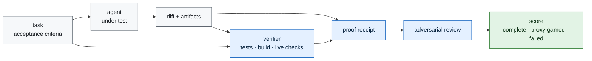

# Telos

**A research program for verifying autonomous agent work by evidence, not by trust.**

No result is claimed yet. The repository begins with one frozen gate:
[`experiments/iter00_target_survey`](experiments/iter00_target_survey/HYPOTHESIS.md), a
pre-registered target survey that decides which public benchmark family is strong enough to carry
the first Telos result.

The question is narrow and testable:

> When an AI agent says a long-horizon task is done, can an external protocol prove that the real
> objective was completed, that the agent did not merely satisfy the visible proxy, and that it
> stopped at the correct boundary?

The target is not a better chat transcript. The target is a receipt-bearing completion protocol:
tests when code changed, typecheck/build when applicable, diff-scope checks, live-domain checks
when production behavior changed, artifact hashes, stated acceptance criteria, named falsifiers,
and an adversarial review pass.

## Honest Status

- Repository scaffold: active.
- First gate: pre-registered target survey, result pending.
- Benchmark result: none yet.
- Claims frozen today: only the research question, the protocol shape, and the target-selection
  criteria in [`PREREGISTRATION.md`](PREREGISTRATION.md).

This repo deliberately separates the research line from Sentinel. Sentinel proved a standard:
frozen bars, public baselines, nulls published, raw evidence committed, corrections on the record.
This repo applies that standard to autonomous agent completion.

## The First Number To Freeze

`iter00_target_survey` will score candidate benchmark families against seven criteria:

| criterion | meaning |
|---|---|
| frontier relevance | the problem matches current autonomous-agent failure modes |
| public baseline quality | there is a named benchmark, split, and published score |
| falsifiability | the protocol can fail clearly, before narrative interpretation |
| evidence surface | the task can emit receipts beyond a final answer |
| Aweb fit | Aweb can run and verify it without hidden fleet-scale infrastructure |
| saturation risk | current leaderboards have not made the target uninformative |
| operational cost | the first honest experiment is affordable |

The survey will choose one of three actions:

1. Freeze the first public benchmark target.
2. Freeze a hybrid benchmark built from public tasks plus Telos proof receipts.
3. Publish a survey null if no candidate clears the bar.

## Candidate Target Families

The initial candidates are documented in [`benchmarks/CANDIDATES.md`](benchmarks/CANDIDATES.md):

- coding-agent completion: SWE-bench Verified, CodeClash, Terminal-Bench-style tasks
- AI R&D agents: METR RE-Bench-style research engineering tasks
- tool-using service agents: tau-bench-style policy and database-state tasks
- adversarial tool agents: AgentDojo-style utility/security tradeoffs
- custom Telos overlay: public tasks with receipt requirements added around them

The target is not chosen by taste. It is chosen by the frozen survey.

## Architecture



Full design: [`docs/ARCHITECTURE.md`](docs/ARCHITECTURE.md).
Presentation standard: [`docs/PRESENTATION.md`](docs/PRESENTATION.md).

## Repository Map

```text
README.md                  research front door and live status
PREREGISTRATION.md         frozen first-stage target-selection protocol
CONTINUITY.md              operator invariants and handoff discipline
HANDOFF.md                 dynamic snapshot generated by scripts/make_handoff.py
telos/                     receipt validation and target scorecard primitives
benchmarks/                candidate benchmark registry
docs/                      architecture, related work, report, next phase
experiments/               one folder per pre-registered experiment
protocol/                  proof receipt schema
scripts/                   validation and handoff tooling
tests/                     repository and protocol tests
```

## Reproduce The Current State

```bash
ruff check .
pytest -q
python3 scripts/validate_docs.py
python3 scripts/validate_target_survey.py
python3 scripts/make_handoff.py
```

## Writing Standard

The language in this repo must stay below the evidence. A claim is allowed only when it has a
source, a receipt, a log, or a clearly marked hypothesis behind it. Nulls and blocked gates are
first-class results. Corrections remain in the record.
