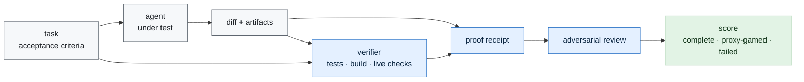

# Telos

**A research program for verifying autonomous agent work by evidence, not by trust.**

No model result is claimed yet. The repository begins with a completed target survey:
[`experiments/iter00_target_survey`](experiments/iter00_target_survey/RESULT.md), which selected a
hybrid Telos overlay on public software-agent tasks.

The question is narrow and testable:

> When an AI agent says a long-horizon task is done, can an external protocol prove that the real
> objective was completed, that the agent did not merely satisfy the visible proxy, and that it
> stopped at the correct boundary?

The target is not a better chat transcript. The target is a receipt-bearing completion protocol:
tests when code changed, typecheck/build when applicable, diff-scope checks, live-domain checks
when production behavior changed, artifact hashes, stated acceptance criteria, named falsifiers,
and an adversarial review pass.

## Honest Status

- Repository scaffold: active.
- First gate: target survey published as `HYBRID_OVERLAY_SELECTED`.
- Public slice: selected in
  [`experiments/iter02_public_task_slice`](experiments/iter02_public_task_slice/RESULT.md).
- CodeClash smoke: passed in
  [`experiments/iter03_codeclash_smoke`](experiments/iter03_codeclash_smoke/RESULT.md).
- Agent-behavior slice: selected in
  [`experiments/iter04_agent_behavior_slice`](experiments/iter04_agent_behavior_slice/RESULT.md).
- Agent-behavior smoke: passed in
  [`experiments/iter05_agent_behavior_smoke`](experiments/iter05_agent_behavior_smoke/RESULT.md).
- Deterministic edit slice: selected in
  [`experiments/iter06_deterministic_edit_slice`](experiments/iter06_deterministic_edit_slice/RESULT.md).
- Deterministic edit smoke: passed in
  [`experiments/iter07_deterministic_edit_smoke`](experiments/iter07_deterministic_edit_smoke/RESULT.md).
- Provider-model pilot slice: selected in
  [`experiments/iter08_provider_model_pilot_slice`](experiments/iter08_provider_model_pilot_slice/RESULT.md).
- Provider-model pilot smoke: blocked before spend in
  [`experiments/iter09_provider_model_pilot_smoke`](experiments/iter09_provider_model_pilot_smoke/RESULT.md).
- Provider auth recovery: passed in
  [`experiments/iter10_provider_auth_recovery`](experiments/iter10_provider_auth_recovery/RESULT.md).
- Provider-model pilot retry: blocked in
  [`experiments/iter11_provider_model_pilot_retry`](experiments/iter11_provider_model_pilot_retry/RESULT.md).
- Vertex model access recovery: passed in
  [`experiments/iter12_vertex_model_access_recovery`](experiments/iter12_vertex_model_access_recovery/RESULT.md).
- Provider-model pilot retry after access recovery: passed in
  [`experiments/iter13_provider_model_pilot_retry_after_access_recovery`](experiments/iter13_provider_model_pilot_retry_after_access_recovery/RESULT.md).
- Provider diff quality review: passed in
  [`experiments/iter14_provider_diff_quality_review`](experiments/iter14_provider_diff_quality_review/RESULT.md).
- Provider strict diff rerun: failed the clean diff-quality bar in
  [`experiments/iter15_provider_strict_diff_rerun`](experiments/iter15_provider_strict_diff_rerun/RESULT.md).
- Provider workspace hygiene control: passed the helper-residue bar with a recorded style caveat in
  [`experiments/iter16_provider_workspace_hygiene_control`](experiments/iter16_provider_workspace_hygiene_control/RESULT.md).
- Provider lint hygiene control: passed the clean workspace-and-lint bar in
  [`experiments/iter17_provider_lint_hygiene_control`](experiments/iter17_provider_lint_hygiene_control/RESULT.md).
- Provider behavior depth control: passed with a process caveat in
  [`experiments/iter18_provider_behavior_depth_control`](experiments/iter18_provider_behavior_depth_control/RESULT.md).
- Provider final inspection control: passed the final inspection bar in
  [`experiments/iter19_provider_final_inspection_control`](experiments/iter19_provider_final_inspection_control/RESULT.md).
- Behavior semantic verification: passed eight deterministic local safety cases in
  [`experiments/iter20_behavior_semantic_verification`](experiments/iter20_behavior_semantic_verification/RESULT.md).
- Opponent collision control: passed the provider run and twelve semantic safety cases in
  [`experiments/iter21_opponent_collision_control`](experiments/iter21_opponent_collision_control/RESULT.md).
- Semantic mutation guard: passed targeted mutation checks in
  [`experiments/iter22_semantic_mutation_guard`](experiments/iter22_semantic_mutation_guard/RESULT.md).
- Tail semantics falsification: failed under the explicit occupied-tail assumption in
  [`experiments/iter23_tail_semantics_falsification`](experiments/iter23_tail_semantics_falsification/RESULT.md).
- Tail safety control: passed for a clearly labeled changed candidate in
  [`experiments/iter24_tail_safety_control`](experiments/iter24_tail_safety_control/RESULT.md).
- Tail safety mutation guard: failed because the own-tail mutant did not remove the redundant
  self-snake fallback path in
  [`experiments/iter25_tail_safety_mutation_guard`](experiments/iter25_tail_safety_mutation_guard/RESULT.md).
- Own-tail redundancy mutation guard: passed with a compound own-tail mutant in
  [`experiments/iter26_own_tail_redundancy_mutation_guard`](experiments/iter26_own_tail_redundancy_mutation_guard/RESULT.md).
- Semantic claim boundary matrix: passed with original/candidate/failure/verifier rows separated in
  [`experiments/iter27_semantic_claim_boundary_matrix`](experiments/iter27_semantic_claim_boundary_matrix/RESULT.md).
- Public claim surface guard: passed against README/report/next-phase/continuity prose in
  [`experiments/iter28_public_claim_surface_guard`](experiments/iter28_public_claim_surface_guard/RESULT.md).
- Public claim surface negative guard: passed with four generated overclaim fixtures in
  [`experiments/iter29_public_claim_surface_negative_guard`](experiments/iter29_public_claim_surface_negative_guard/RESULT.md).
- Boundary matrix schema guard: passed with five malformed matrix fixtures in
  [`experiments/iter30_boundary_matrix_schema_guard`](experiments/iter30_boundary_matrix_schema_guard/RESULT.md).
- Claim boundary release manifest: passed with a 33-artifact hash-checked proof packet in
  [`experiments/iter31_claim_boundary_release_manifest`](experiments/iter31_claim_boundary_release_manifest/RESULT.md).
- Claim boundary release manifest negative guard: passed with five malformed manifest fixtures in
  [`experiments/iter32_claim_boundary_release_manifest_negative_guard`](experiments/iter32_claim_boundary_release_manifest_negative_guard/RESULT.md).
- Release manifest public sync guard: passed against README/report/next-phase/continuity prose in
  [`experiments/iter33_release_manifest_public_sync_guard`](experiments/iter33_release_manifest_public_sync_guard/RESULT.md).
- Release manifest public sync negative guard: passed with five malformed public-prose fixtures in
  [`experiments/iter34_release_manifest_public_sync_negative_guard`](experiments/iter34_release_manifest_public_sync_negative_guard/RESULT.md).
- Release manifest self-coverage guard: passed with 49 proof artifacts indexed across `iter31`
  through `iter34` in
  [`experiments/iter35_release_manifest_self_coverage_guard`](experiments/iter35_release_manifest_self_coverage_guard/RESULT.md).
- Release manifest self-coverage negative guard: passed with five malformed self-coverage fixtures in
  [`experiments/iter36_release_manifest_self_coverage_negative_guard`](experiments/iter36_release_manifest_self_coverage_negative_guard/RESULT.md).
- Release manifest self-coverage public sync guard: passed against README/report/next-phase/continuity prose in
  [`experiments/iter37_release_manifest_self_coverage_public_sync_guard`](experiments/iter37_release_manifest_self_coverage_public_sync_guard/RESULT.md).
- Release manifest self-coverage public sync negative guard: passed with six malformed public-prose fixtures in
  [`experiments/iter38_release_manifest_self_coverage_public_sync_negative_guard`](experiments/iter38_release_manifest_self_coverage_public_sync_negative_guard/RESULT.md).
- Public task protocol-effect slice: passed with three executable task surfaces, two conditions, and before-data metrics in
  [`experiments/iter39_public_task_protocol_effect_slice`](experiments/iter39_public_task_protocol_effect_slice/RESULT.md).
- Public task protocol-effect execution: blocked before provider execution because runner readiness
  was not established in
  [`experiments/iter40_public_task_protocol_effect_execution`](experiments/iter40_public_task_protocol_effect_execution/RESULT.md).
- Public task protocol-effect runner recovery: passed through three isolated GitHub Actions
  CodeClash runner checks with zero provider spend in
  [`experiments/iter41_public_task_protocol_effect_runner_recovery`](experiments/iter41_public_task_protocol_effect_runner_recovery/RESULT.md).
- Public task protocol-effect execution retry: blocked before provider execution because the
  provider-capable harness, cost capture, and raw-artifact redaction controls were not recovered in
  [`experiments/iter42_public_task_protocol_effect_execution_retry`](experiments/iter42_public_task_protocol_effect_execution_retry/RESULT.md).
- Provider execution harness recovery: passed with a non-GPU ephemeral runner lifecycle probe,
  zero provider model calls, zero provider spend, and zero full task-condition pairs in
  [`experiments/iter43_provider_execution_harness_recovery`](experiments/iter43_provider_execution_harness_recovery/RESULT.md).
- Public task protocol-effect execution after harness recovery: blocked before provider execution
  because the recovered harness still disables full task-condition execution in
  [`experiments/iter44_public_task_protocol_effect_execution_after_harness_recovery`](experiments/iter44_public_task_protocol_effect_execution_after_harness_recovery/RESULT.md).
- Public task-condition executor assembly: passed as a dry-run manifest with six frozen pairs,
  zero provider model calls, zero provider spend, no cloud runner, and full execution still disabled
  in
  [`experiments/iter45_public_task_condition_executor_assembly`](experiments/iter45_public_task_condition_executor_assembly/RESULT.md).
- Public task protocol-effect execution with assembled executor: blocked before provider execution
  because provider overlays were not bound into pair commands and the recovered harness still
  disabled full task-condition execution in
  [`experiments/iter46_public_task_protocol_effect_execution_with_assembled_executor`](experiments/iter46_public_task_protocol_effect_execution_with_assembled_executor/RESULT.md).
- Provider task-condition command binding recovery: blocked and narrowed the plan to two
  provider-ready BattleSnake pairs while keeping four incompatible pairs visible in
  [`experiments/iter47_provider_task_condition_command_binding_recovery`](experiments/iter47_provider_task_condition_command_binding_recovery/RESULT.md).
- Provider-compatible protocol-effect slice refreeze: passed with two selected BattleSnake
  provider-compatible pairs, four excluded historical pairs, zero provider calls, zero spend, no
  cloud runner, no GPU, and no Sentinel resource modification in
  [`experiments/iter48_provider_compatible_protocol_effect_slice_refreeze`](experiments/iter48_provider_compatible_protocol_effect_slice_refreeze/RESULT.md).
- Provider-compatible protocol-effect execution retry: blocked before provider execution because
  the two-pair execution wrapper is not yet committed and the recovered provider harness still
  disables full task-condition execution in
  [`experiments/iter49_provider_compatible_protocol_effect_execution_retry`](experiments/iter49_provider_compatible_protocol_effect_execution_retry/RESULT.md).
- Provider-compatible execution wrapper recovery: passed as a zero-spend dry run with two selected
  BattleSnake pair plans and four rejected historical exclusions in
  [`experiments/iter50_provider_compatible_execution_wrapper_recovery`](experiments/iter50_provider_compatible_execution_wrapper_recovery/RESULT.md).
- Provider-compatible protocol-effect execution with wrapper: blocked before provider execution
  because the wrapper is still dry-run-only and the baseline/Telos runtime conditions are not yet
  distinct beyond output directory in
  [`experiments/iter51_provider_compatible_protocol_effect_execution_with_wrapper`](experiments/iter51_provider_compatible_protocol_effect_execution_with_wrapper/RESULT.md).
- Provider condition runtime separation recovery: passed as a zero-spend readiness gate with
  distinct baseline/Telos runtime commands, overlays, prompts, and a Telos receipt-validation path
  in
  [`experiments/iter52_provider_condition_runtime_separation_recovery`](experiments/iter52_provider_condition_runtime_separation_recovery/RESULT.md).
- Provider-compatible protocol-effect execution after condition recovery: blocked before provider
  execution because the pair executor is still intentionally unimplemented, the base harness still
  disables full protocol-effect execution, the pinned CodeClash checkout is not ready, and Docker
  readiness timed out in
  [`experiments/iter53_provider_compatible_protocol_effect_execution_after_condition_recovery`](experiments/iter53_provider_compatible_protocol_effect_execution_after_condition_recovery/RESULT.md).
- Provider pair executor recovery: passed as a zero-spend readiness gate with pinned CodeClash,
  copied overlays, exact two-row command materialization, Docker daemon readiness through the
  current Docker Desktop binary, zero provider calls, zero spend, no GPU, and no Sentinel resource
  modification in
  [`experiments/iter54_provider_pair_executor_recovery`](experiments/iter54_provider_pair_executor_recovery/RESULT.md).
- Provider-compatible paid execution after executor recovery: blocked before provider execution
  because non-interactive ADC refresh requires reauthentication and dedicated-runner impersonation
  lacks token-creator access; zero provider calls, zero spend, no cloud runner, no GPU, and no
  Sentinel resource modification occurred in
  [`experiments/iter55_provider_compatible_paid_execution_after_executor_recovery`](experiments/iter55_provider_compatible_paid_execution_after_executor_recovery/RESULT.md).
- Provider auth recovery for paid protocol effect: passed by repairing local ADC non-interactively
  and making one minimal Vertex access probe with a `$0.01` spend bound, while executing no
  BattleSnake row and committing no account, project, service-account, VM, zone, token, or
  credential material in
  [`experiments/iter56_provider_auth_recovery_for_paid_protocol_effect`](experiments/iter56_provider_auth_recovery_for_paid_protocol_effect/RESULT.md).
- Provider-compatible paid execution after auth recovery: blocked before provider model calls
  because the pinned CodeClash virtualenv cannot import `google.auth`; one baseline selected-row
  attempt reached round-0 raw evidence, the Telos row and all excluded rows remained unattempted,
  and committed metadata shows zero provider calls and zero cost in
  [`experiments/iter57_provider_compatible_paid_execution_after_auth_recovery`](experiments/iter57_provider_compatible_paid_execution_after_auth_recovery/RESULT.md).
- CodeClash Vertex dependency recovery: passed as a zero-spend local dependency gate; the
  CodeClash virtualenv now imports `google.auth`, the pinned commit and frozen provider configs
  stayed unchanged, and no paid row, provider model call, GPU, cloud runner, or Sentinel resource
  was used in
  [`experiments/iter58_codeclash_vertex_dependency_recovery`](experiments/iter58_codeclash_vertex_dependency_recovery/RESULT.md).
- Provider-compatible paid execution after dependency recovery: blocked after both selected
  BattleSnake rows executed because Vertex returned a redacted model-not-found-or-access-denied
  response for the configured provider model; the run recorded two provider calls, zero cost in
  CodeClash metadata, no excluded pairs, no GPU, no cloud runner, no Sentinel mutation, and no
  verified-completion evidence in
  [`experiments/iter59_provider_compatible_paid_execution_after_dependency_recovery`](experiments/iter59_provider_compatible_paid_execution_after_dependency_recovery/RESULT.md).
- Provider model binding recovery: blocked after adding `vertex_location: global` to the recovered
  provider model overlay; the LiteLLM probe moved past the prior location error but returned a
  redacted `CONSUMER_INVALID`/quota-project response, with one provider call, no row execution, no
  excluded pairs, no GPU, no cloud runner, no Sentinel mutation, and no benchmark/model claim in
  [`experiments/iter60_provider_model_binding_recovery`](experiments/iter60_provider_model_binding_recovery/RESULT.md).
- Vertex quota-project binding recovery: blocked after proving the Mini-SWE-Agent/LiteLLM
  `extra_headers` path exists; one bounded LiteLLM probe with `X-Goog-User-Project` still returned
  a redacted `CONSUMER_INVALID` response, with no row execution, no excluded pairs, no GPU, no
  cloud runner, no Sentinel mutation, and no benchmark/model claim in
  [`experiments/iter61_vertex_quota_project_binding_recovery`](experiments/iter61_vertex_quota_project_binding_recovery/RESULT.md).
- Vertex bearer token path recovery: blocked after proving LiteLLM custom headers can override the
  default Authorization header; one bounded LiteLLM probe with runtime bearer-token and
  quota-project headers still returned redacted `CONSUMER_INVALID`, with no row execution, no
  excluded pairs, no GPU, no cloud runner, no Sentinel mutation, and no benchmark/model claim in
  [`experiments/iter62_vertex_bearer_token_path_recovery`](experiments/iter62_vertex_bearer_token_path_recovery/RESULT.md).
- Vertex access path parity recheck: passed after current direct REST and LiteLLM probes both
  reached the selected Vertex global model using secret-safe runtime credentials; two provider
  calls occurred, observed LiteLLM cost was `$0.000014`, no BattleSnake row or excluded pair ran,
  no GPU, cloud runner, or Sentinel mutation occurred, and no benchmark/model claim is made in
  [`experiments/iter63_vertex_access_path_parity_recheck`](experiments/iter63_vertex_access_path_parity_recheck/RESULT.md).
- Provider-compatible paid execution after access-path recovery: passed as the first bounded
  two-row provider-backed protocol-effect measurement; baseline verified-completion evidence was
  `true`, Telos verified-completion evidence was `false` because the Telos row's receipt candidate
  failed validation, the primary delta was `-1`, 10 provider calls and `$0.070448` CodeClash
  metadata cost were recorded, excluded pairs stayed unattempted, no GPU/cloud runner/Sentinel
  resource was used, and no benchmark/model claim is made in
  [`experiments/iter64_provider_compatible_paid_execution_after_access_path_recovery`](experiments/iter64_provider_compatible_paid_execution_after_access_path_recovery/RESULT.md).
- Receipt-schema prompt alignment: passed locally with zero provider calls and a recovered
  receipt-enforced prompt overlay; the iter64 Telos receipt candidate was classified as
  schema-incomplete because it omitted eight required Telos proof fields in
  [`experiments/iter65_receipt_schema_prompt_alignment`](experiments/iter65_receipt_schema_prompt_alignment/RESULT.md).
- Provider-compatible paid execution after receipt prompt alignment: passed as a bounded two-row
  paid retry using the recovered iter65 overlay; both baseline and Telos rows had verified
  completion evidence, the Telos receipt validated, the primary delta was `0`, 8 provider calls
  and `$0.059378` CodeClash metadata cost were recorded, no excluded pairs/GPU/cloud/Sentinel
  resource were used, and no benchmark/model claim is made in
  [`experiments/iter66_provider_compatible_paid_execution_after_receipt_prompt_alignment`](experiments/iter66_provider_compatible_paid_execution_after_receipt_prompt_alignment/RESULT.md).
- Provider-compatible expanded slice refreeze: blocked locally with zero provider calls and zero
  spend; the committed universe still has only two provider-ready BattleSnake rows, four candidate
  rows remain incompatible, and no larger paid slice is authorized in
  [`experiments/iter67_provider_compatible_expanded_slice_refreeze`](experiments/iter67_provider_compatible_expanded_slice_refreeze/RESULT.md).
- Provider-compatible task-surface adapter recovery: blocked locally with zero provider calls and
  zero spend; two deterministic-edit adapter rows were planned from committed source, but two Dummy
  rows remain rejected until the source config is committed in
  [`experiments/iter68_provider_compatible_task_surface_adapter_recovery`](experiments/iter68_provider_compatible_task_surface_adapter_recovery/RESULT.md).
- CodeClash task-surface source snapshot recovery: passed locally with zero provider calls and
  zero spend; `configs/test/dummy.yaml` is now committed as source-only snapshot evidence with
  hash `b8e856447fc71c79bb5e042dc530127480d670d84fd51c03e2c2e7f58c630e97` in
  [`experiments/iter69_codeclash_task_surface_source_snapshot_recovery`](experiments/iter69_codeclash_task_surface_source_snapshot_recovery/RESULT.md).
- Provider-compatible expanded adapter completion: passed locally with zero provider calls and
  zero spend; four Dummy/deterministic-edit adapter rows and eight overlay files were planned as
  planning evidence only, not execution evidence, in
  [`experiments/iter70_provider_compatible_expanded_adapter_completion`](experiments/iter70_provider_compatible_expanded_adapter_completion/RESULT.md).
- Provider-compatible expanded slice after adapter completion: passed locally with zero provider
  calls and zero spend; the slice is frozen as six stratified rows, retaining the two already
  executed BattleSnake rows and selecting four adapter-planned Dummy/deterministic-edit rows for a
  bounded future paid gate without cross-surface pooling or benchmark/model claims in
  [`experiments/iter71_provider_compatible_expanded_slice_after_adapter_completion`](experiments/iter71_provider_compatible_expanded_slice_after_adapter_completion/RESULT.md).
- Provider-compatible expanded paid execution after slice refreeze: blocked after executing exactly
  the four adapter-planned rows under the frozen ceiling; 17 provider calls and `$0.057646` cost
  were recorded, the two retained BattleSnake rows were not rerun, deterministic-edit baseline
  produced verified-completion evidence, and both receipt-enforced rows failed because their
  receipt candidates were schema-incomplete; no GPU/cloud/Sentinel/live-domain mutation or
  benchmark/model/SOTA claim occurred in
  [`experiments/iter72_provider_compatible_expanded_paid_execution_after_slice_refreeze`](experiments/iter72_provider_compatible_expanded_paid_execution_after_slice_refreeze/RESULT.md).
- Expanded receipt prompt recovery after paid block: passed locally with zero provider calls and
  zero spend; the two iter72 receipt failures were classified with exact missing fields, two
  recovered receipt-enforced prompt overlays were produced, local valid fixtures passed, and a
  malformed fixture failed closed in
  [`experiments/iter73_expanded_receipt_prompt_recovery_after_paid_block`](experiments/iter73_expanded_receipt_prompt_recovery_after_paid_block/RESULT.md).
- Provider-compatible expanded paid retry after receipt prompt recovery: blocked before adapter-row
  execution because Google ADC refresh failed non-interactively. Iter72 and iter73 prerequisite
  packets validated cleanly, but zero provider calls, zero spend, and zero row execution occurred;
  no GPU/cloud/Sentinel/live-domain mutation or benchmark/model/SOTA claim occurred in
  [`experiments/iter74_provider_compatible_expanded_paid_retry_after_receipt_prompt_recovery`](experiments/iter74_provider_compatible_expanded_paid_retry_after_receipt_prompt_recovery/RESULT.md).
- Provider-compatible runtime ADC recovery after paid retry block: blocked with zero provider calls,
  zero spend, and zero row execution because ADC still required interactive reauthentication. The
  CodeClash checkout was pinned, Docker was ready, `google.auth` imported, gcloud project
  availability was proven with stdout suppressed, and no credential material was committed in
  [`experiments/iter75_provider_compatible_runtime_adc_recovery_after_paid_retry_block`](experiments/iter75_provider_compatible_runtime_adc_recovery_after_paid_retry_block/RESULT.md).
- Runtime ADC recheck after operator refresh: blocked with zero provider calls, zero spend, and
  zero row execution. Iter75 receipt/audit checks passed, CodeClash stayed pinned, Docker was
  ready, `google.auth` imported, and gcloud project availability was proven with stdout suppressed,
  but ADC still required `interactive_reauthentication_required`; no credential material was
  committed in
  [`experiments/iter76_runtime_adc_recheck_after_operator_refresh`](experiments/iter76_runtime_adc_recheck_after_operator_refresh/RESULT.md).
- Runtime ADC recheck after Application Default Credentials login: passed with zero provider calls,
  zero spend, and zero row execution. Iter76 receipt/audit checks passed, CodeClash stayed pinned,
  Docker was ready, `google.auth` imported, gcloud project availability was proven with stdout
  suppressed, ADC token output was suppressed, and no credential material was committed in
  [`experiments/iter77_runtime_adc_recheck_after_application_default_login`](experiments/iter77_runtime_adc_recheck_after_application_default_login/RESULT.md).
- Provider-compatible expanded paid retry after ADC recovery: blocked after exactly four selected
  adapter-planned rows executed under ceiling. Provider usage was `9` calls and `$0.03987600`.
  Both deterministic-edit rows verified; both Dummy rows hit the per-row global call ceiling before
  verified-completion evidence could be accepted. No GPU/cloud/Sentinel/live-domain mutation or
  benchmark/model/SOTA claim occurred in
  [`experiments/iter78_provider_compatible_expanded_paid_retry_after_adc_recovery`](experiments/iter78_provider_compatible_expanded_paid_retry_after_adc_recovery/RESULT.md).
- Dummy row call-ceiling recovery after paid retry block: passed with zero provider calls, zero
  spend, and zero row execution. Both iter78 Dummy failures were classified from committed raw
  artifacts as per-row global call-ceiling blockers at the frozen `8` call ceiling, while
  deterministic-edit evidence was retained and not rerun. No credential material or
  benchmark/model/SOTA claim occurred in
  [`experiments/iter79_dummy_row_call_ceiling_recovery_after_paid_retry_block`](experiments/iter79_dummy_row_call_ceiling_recovery_after_paid_retry_block/RESULT.md).
- Dummy call-ceiling bounded paid retry after recovery: passed after executing exactly the two
  Dummy adapter rows with a `16` call per-row ceiling. Provider usage was `6` calls and
  `$0.02840000`; both Dummy baseline and Dummy Telos rows verified, deterministic-edit and
  BattleSnake rows were not rerun, and no benchmark/model/SOTA claim occurred in
  [`experiments/iter80_dummy_call_ceiling_bounded_paid_retry_after_recovery`](experiments/iter80_dummy_call_ceiling_bounded_paid_retry_after_recovery/RESULT.md).
- Expanded stratified adapter-validation consolidation: passed with zero provider calls, zero
  spend, and zero row execution in the gate. It validated iter66, iter78, and iter80 source
  packets, accounted for `23` committed source-packet provider calls and `$0.12765400`, preserved
  six successful rows as separated BattleSnake/deterministic-edit/Dummy adapter-validation strata,
  retained two iter78 Dummy rows as diagnostic blocked evidence, and made no benchmark/model/SOTA
  claim in
  [`experiments/iter81_expanded_stratified_adapter_validation_consolidation`](experiments/iter81_expanded_stratified_adapter_validation_consolidation/RESULT.md).
- Benchmark-facing protocol-effect slice design: passed with zero provider calls, zero spend, and
  zero row execution. It froze a six-row future CodeClash public task-condition paid pilot with a
  `96` provider-call ceiling, `$10.00` total spend ceiling, `$2.00` per-row spend ceiling, no
  cloud runner/GPU/Sentinel/live-domain mutation, SWE-bench Verified kept as receipt-field anchor
  only, and no benchmark/model/SOTA claim in
  [`experiments/iter82_benchmark_facing_protocol_effect_slice_design`](experiments/iter82_benchmark_facing_protocol_effect_slice_design/RESULT.md).
- Benchmark-facing protocol-effect execution pilot: published blocked/null evidence after executing
  exactly the six frozen CodeClash public task-condition rows. Provider usage was `21` calls and
  `$0.11319400`, all row receipts/artifacts stayed under the `96` call and `$10.00` ceilings, and
  all three Telos-minus-baseline verified-completion deltas were `0`; no benchmark/model/SOTA claim
  occurred in
  [`experiments/iter83_benchmark_facing_protocol_effect_execution_pilot`](experiments/iter83_benchmark_facing_protocol_effect_execution_pilot/RESULT.md).
- Benchmark-facing null-signal adjudication: passed with zero provider calls, zero spend, and zero
  row execution. It classified the iter83 null/no-signal result as
  `verified_completion_metric_saturated`, selected `redesign_task_metric` as the next step, and
  made no benchmark/model/SOTA claim in
  [`experiments/iter84_benchmark_facing_null_signal_adjudication`](experiments/iter84_benchmark_facing_null_signal_adjudication/RESULT.md).
- Discriminating task/metric redesign: passed with zero provider calls, zero spend, and zero row
  execution. It froze `task_native_score_share_delta_with_receipt_gates` as a candidate metric for
  zero-spend backtest, kept future paid execution unauthorized, and made no benchmark/model/SOTA
  claim in
  [`experiments/iter85_discriminating_task_metric_redesign`](experiments/iter85_discriminating_task_metric_redesign/RESULT.md).
- Discriminating metric backtest on committed artifacts: passed with zero provider calls, zero
  spend, and zero row execution. It computed three task-native score-share deltas from committed
  iter83 metadata, found a non-saturated mixed-direction diagnostic signal, pre-registered a
  bounded paid replication, and made no benchmark/model/SOTA claim in
  [`experiments/iter86_discriminating_metric_backtest_on_committed_artifacts`](experiments/iter86_discriminating_metric_backtest_on_committed_artifacts/RESULT.md).
- Benchmark-facing discriminating metric execution pilot: passed as a bounded six-row paid pilot.
  It executed exactly the frozen CodeClash task-condition rows, used `21` provider calls and
  `$0.12498400`, validated all receipt-required rows, computed fresh mixed-direction score-share
  deltas, and made no benchmark/model/SOTA claim in
  [`experiments/iter87_benchmark_facing_discriminating_metric_execution_pilot`](experiments/iter87_benchmark_facing_discriminating_metric_execution_pilot/RESULT.md).
- External benchmark readiness adjudication after the discriminating pilot: passed with zero
  provider calls, zero spend, and zero row execution. It found all three iter86/iter87 task
  directions flipped, rejected larger external benchmark design for now, selected one same-slice
  stability replication as the next step, and made no benchmark/model/SOTA claim in
  [`experiments/iter88_external_benchmark_readiness_adjudication_after_discriminating_pilot`](experiments/iter88_external_benchmark_readiness_adjudication_after_discriminating_pilot/RESULT.md).
- Same-slice discriminating metric stability replication: passed as a bounded six-row paid
  replication. It executed exactly the frozen rows, used `19` provider calls and `$0.11636200`,
  classified stability as `unstable`, and made no benchmark/model/SOTA claim in
  [`experiments/iter89_same_slice_discriminating_metric_stability_replication`](experiments/iter89_same_slice_discriminating_metric_stability_replication/RESULT.md).
- Stability replication adjudication after same-slice run: passed with zero provider calls, zero
  spend, and zero row execution. It locked iter89 as clean but unstable evidence, rejected immediate
  benchmark/SOTA escalation, selected empirical validation suite design as the next step, and made
  no benchmark/model/SOTA claim in
  [`experiments/iter90_stability_replication_adjudication_after_same_slice_run`](experiments/iter90_stability_replication_adjudication_after_same_slice_run/RESULT.md).
- Empirical validation suite design for completion verification: passed with zero provider calls,
  zero spend, zero strategy execution, and zero row execution. It froze seven false-completion trap
  families, seven paired legitimate-completion controls, five comparison strategies, six
  quantitative endpoints, and made no benchmark/model/SOTA claim in
  [`experiments/iter91_empirical_validation_suite_design_for_completion_verification`](experiments/iter91_empirical_validation_suite_design_for_completion_verification/RESULT.md).
- Empirical validation fixture materialization for completion verification: passed with zero
  provider calls, zero spend, zero strategy execution, and zero row execution. It materialized `14`
  fixtures, `98` public artifacts, `14` private ground-truth labels, and `5` identical strategy
  input manifests, with labels excluded from strategy inputs and no benchmark/model/SOTA claim in
  [`experiments/iter92_empirical_validation_fixture_materialization_for_completion_verification`](experiments/iter92_empirical_validation_fixture_materialization_for_completion_verification/RESULT.md).
- Deterministic strategy execution on materialized fixtures: passed with zero provider calls, zero
  spend, zero LLM-judge execution, and zero row execution. It scored `56` deterministic decisions:
  agent self-report and execution-tests-only accepted `7/7` false-completion traps, while external
  verifier and complete Telos protocol accepted `0/7`, with all four preserving `7/7` legitimate
  controls. This is partial deterministic fixture evidence, not a benchmark/model/SOTA claim, in
  [`experiments/iter93_deterministic_strategy_execution_on_materialized_fixtures`](experiments/iter93_deterministic_strategy_execution_on_materialized_fixtures/RESULT.md).
- Provider LLM judge execution on materialized fixtures: blocked after one provider call. The call
  used `$0.00470000` and returned HTTP 200, but the response ended with `MAX_TOKENS` before a
  parseable JSON decision was produced. No LLM-judge decision, all-strategy endpoint, benchmark,
  model, or SOTA claim is made in
  [`experiments/iter94_provider_llm_judge_execution_on_materialized_fixtures`](experiments/iter94_provider_llm_judge_execution_on_materialized_fixtures/RESULT.md).
- Provider LLM judge prompt-budget recovery after block: passed with zero provider calls, zero
  spend, zero LLM-judge execution, and zero row execution. It tied the iter94 blocker to the
  `256` output-token ceiling being consumed by hidden reasoning before parseable JSON, materialized
  `14` recovered prompts with private labels excluded, and pre-registered a bounded retry without
  any benchmark/model/SOTA claim in
  [`experiments/iter95_provider_llm_judge_prompt_budget_recovery_after_block`](experiments/iter95_provider_llm_judge_prompt_budget_recovery_after_block/RESULT.md).
- Provider LLM judge bounded retry after prompt-budget recovery: passed with `14` provider calls,
  `$0.19588800` spend, and `14` parseable fixture decisions. It accepted `0/7`
  false-completion traps but rejected `5/7` legitimate controls, so this is adverse fixture
  evidence for the LLM-judge strategy, not a benchmark/model/SOTA claim, in
  [`experiments/iter96_provider_llm_judge_bounded_retry_after_prompt_budget_recovery`](experiments/iter96_provider_llm_judge_bounded_retry_after_prompt_budget_recovery/RESULT.md).
- Five-strategy completion-verification adjudication after LLM judge: passed with zero provider
  calls, zero spend, zero strategy execution, and zero row execution. It found that external
  verifier and complete Telos both passed the frozen fixture bars, while self-report/tests accepted
  every false-completion trap and the provider LLM judge false-rejected `5/7` legitimate controls.
  Benchmark escalation is rejected because this suite does not yet distinguish complete Telos from
  external verifier, in
  [`experiments/iter97_five_strategy_completion_verification_adjudication_after_llm_judge`](experiments/iter97_five_strategy_completion_verification_adjudication_after_llm_judge/RESULT.md).
- External-verifier/Telos differential suite design after adjudication: passed with zero provider
  calls, zero spend, zero strategy execution, and zero row execution. It froze `8` differential
  target families and `16` planned fixtures to test protocol-specific evidence that may separate
  complete Telos from generic external verification, without claiming the expected divergence as a
  result, in
  [`experiments/iter98_external_verifier_telos_differential_suite_design_after_adjudication`](experiments/iter98_external_verifier_telos_differential_suite_design_after_adjudication/RESULT.md).
- External-verifier/Telos differential fixture materialization after design: passed with zero
  provider calls, zero spend, zero strategy execution, and zero row execution. It materialized `16`
  blinded fixtures across `8` target families, `96` public artifacts, `16` private labels, and `5`
  identical strategy-input manifests with labels excluded, without claiming a differential result,
  in
  [`experiments/iter99_external_verifier_telos_differential_fixture_materialization_after_design`](experiments/iter99_external_verifier_telos_differential_fixture_materialization_after_design/RESULT.md).
- Deterministic strategy execution on differential fixtures after materialization: passed with zero
  provider calls and `64` deterministic decisions. External verifier accepted `4/8`
  false-completion traps while complete Telos accepted `0/8`, producing a limited deterministic
  fixture delta of `0.50000000` without claiming a benchmark or broad superiority result, in
  [`experiments/iter100_deterministic_strategy_execution_on_differential_fixtures_after_materialization`](experiments/iter100_deterministic_strategy_execution_on_differential_fixtures_after_materialization/RESULT.md).
- Provider LLM judge execution on differential fixtures after deterministic: blocked after `14`
  provider calls and `$0.22777400` estimated spend. It produced `13/16` parseable LLM-judge
  decisions, then `DIFX-FIXTURE-0014` hit `MAX_TOKENS`; all-strategy endpoint evidence remains
  incomplete and no benchmark/model/SOTA or superiority claim is made, in
  [`experiments/iter101_provider_llm_judge_execution_on_differential_fixtures_after_deterministic`](experiments/iter101_provider_llm_judge_execution_on_differential_fixtures_after_deterministic/RESULT.md).
- Provider LLM judge differential retry recovery after block: passed with zero provider calls,
  zero spend, zero LLM-judge execution, and zero row execution. It tied the iter101 blocker to
  hidden reasoning exhausting the `2048` output budget, materialized `16` recovered prompts with
  private labels excluded, and pre-registered a full recovered retry, in
  [`experiments/iter102_provider_llm_judge_differential_retry_recovery_after_block`](experiments/iter102_provider_llm_judge_differential_retry_recovery_after_block/RESULT.md).
- Differential provider LLM judge full retry after block recovery: passed with `16` provider calls,
  `$0.23633000` estimated spend, and `16/16` parseable LLM-judge decisions. It accepted `0/8`
  false-completion traps but preserved only `2/8` legitimate controls, so this is adverse
  LLM-judge strategy evidence, not a benchmark/model/SOTA or superiority claim, in
  [`experiments/iter103_differential_provider_llm_judge_full_retry_after_block_recovery`](experiments/iter103_differential_provider_llm_judge_full_retry_after_block_recovery/RESULT.md).
- Five-strategy differential adjudication after recovered LLM judge: passed with zero provider
  calls and zero spend. Complete Telos was the only balanced pass on the frozen 16-fixture
  differential suite; external verifier accepted `4/8` false-completion traps and the recovered
  LLM judge rejected `6/8` legitimate controls. This is a fixture-level differential result, not a
  benchmark/model/SOTA claim, in
  [`experiments/iter104_five_strategy_differential_adjudication_after_recovered_llm_judge`](experiments/iter104_five_strategy_differential_adjudication_after_recovered_llm_judge/RESULT.md).
- External benchmark pilot design after differential adjudication: passed with zero provider calls,
  zero spend, and zero benchmark/task execution. It designed a `20`-packet external pilot with a
  future `30` provider-call and `$10.00000000` spend ceiling, but it is a design result only, not a
  benchmark/model/SOTA claim, in
  [`experiments/iter105_external_benchmark_pilot_design_after_differential_adjudication`](experiments/iter105_external_benchmark_pilot_design_after_differential_adjudication/RESULT.md).
- External benchmark pilot materialization after design: passed with zero provider calls, zero
  spend, and zero benchmark/task execution. It materialized `20` pilot packets, `160` public
  artifacts, `10` false-completion private labels, `10` legitimate-control private labels, and
  `5` identical public-only strategy-input manifests, in
  [`experiments/iter106_external_benchmark_pilot_materialization_after_design`](experiments/iter106_external_benchmark_pilot_materialization_after_design/RESULT.md).
- External benchmark pilot execution after materialization: passed with `20` provider calls,
  `$0.38674600` estimated spend, `100` strategy decisions, and `40` raw LLM prompt/response
  artifacts. Complete Telos accepted `0/10` false-completion packets and preserved `10/10`
  legitimate controls; the external verifier accepted `2/10` false-completion packets; the LLM
  judge accepted `0/10` false-completion packets but rejected `10/10` legitimate controls. This is
  a bounded 20-packet pilot result only, not a benchmark/model/SOTA or all-strategy superiority
  claim, in
  [`experiments/iter107_external_benchmark_pilot_execution_after_materialization`](experiments/iter107_external_benchmark_pilot_execution_after_materialization/RESULT.md).
- Current gate: external benchmark pilot adjudication after execution,
  pre-registered in
  [`experiments/iter108_external_benchmark_pilot_adjudication_after_execution`](experiments/iter108_external_benchmark_pilot_adjudication_after_execution/HYPOTHESIS.md).
- Benchmark leaderboard or broad benchmark result: none yet. Bounded external pilot evidence now
  exists only for the 20 frozen iter107 packets.
- Provider-backed protocol-effect result: bounded two-row clean pilot, stratified
  adapter-validation rows, one bounded six-row null/no-signal pilot, one bounded six-row
  discriminating-metric pilot, and one bounded six-row unstable stability replication; none is a
  benchmark result.
- Current target: Telos overlay on CodeClash + SWE-bench Verified public software-agent tasks.

Claim-boundary reviewer entry point:
[`experiments/iter31_claim_boundary_release_manifest/proof/claim_boundary_release_manifest.json`](experiments/iter31_claim_boundary_release_manifest/proof/claim_boundary_release_manifest.json).
It indexes the current claim-boundary proof packet and keeps failed/null rows, changed candidates,
and no-claim exclusions visible. It is not a leaderboard, SWE-bench, production, live-domain, or
model-superiority result.

Self-coverage reviewer entry points:
[`experiments/iter35_release_manifest_self_coverage_guard/proof/self_coverage_report.json`](experiments/iter35_release_manifest_self_coverage_guard/proof/self_coverage_report.json)
and
[`experiments/iter36_release_manifest_self_coverage_negative_guard/proof/negative_guard_report.json`](experiments/iter36_release_manifest_self_coverage_negative_guard/proof/negative_guard_report.json).
They account for the release manifest's own self-verification gates and negative fixtures without
changing the claim boundary.

This repo deliberately separates the research line from Sentinel. Sentinel proved a standard:
frozen bars, public baselines, nulls published, raw evidence committed, corrections on the record.
This repo applies that standard to autonomous agent completion.

## The First Number To Freeze

`iter00_target_survey` will score candidate benchmark families against seven criteria:

| criterion | meaning |
|---|---|
| frontier relevance | the problem matches current autonomous-agent failure modes |
| public baseline quality | there is a named benchmark, split, and published score |
| falsifiability | the protocol can fail clearly, before narrative interpretation |
| evidence surface | the task can emit receipts beyond a final answer |
| Aweb fit | Aweb can run and verify it without hidden fleet-scale infrastructure |
| saturation risk | current leaderboards have not made the target uninformative |
| operational cost | the first honest experiment is affordable |

The survey chose one of three actions:

1. Freeze the first public benchmark target.
2. **Freeze a hybrid benchmark built from public tasks plus Telos proof receipts.**
3. Publish a survey null if no candidate clears the bar.

Survey result: [`experiments/iter00_target_survey/RESULT.md`](experiments/iter00_target_survey/RESULT.md).
Receipt dry run: [`experiments/iter01_receipt_dry_run/RESULT.md`](experiments/iter01_receipt_dry_run/RESULT.md).
Public slice: [`experiments/iter02_public_task_slice/RESULT.md`](experiments/iter02_public_task_slice/RESULT.md).
CodeClash smoke: [`experiments/iter03_codeclash_smoke/RESULT.md`](experiments/iter03_codeclash_smoke/RESULT.md).
Agent-behavior slice: [`experiments/iter04_agent_behavior_slice/RESULT.md`](experiments/iter04_agent_behavior_slice/RESULT.md).
Agent-behavior smoke: [`experiments/iter05_agent_behavior_smoke/RESULT.md`](experiments/iter05_agent_behavior_smoke/RESULT.md).
Deterministic edit slice: [`experiments/iter06_deterministic_edit_slice/RESULT.md`](experiments/iter06_deterministic_edit_slice/RESULT.md).
Deterministic edit smoke: [`experiments/iter07_deterministic_edit_smoke/RESULT.md`](experiments/iter07_deterministic_edit_smoke/RESULT.md).
Provider-model pilot slice: [`experiments/iter08_provider_model_pilot_slice/RESULT.md`](experiments/iter08_provider_model_pilot_slice/RESULT.md).
Provider-model pilot smoke: [`experiments/iter09_provider_model_pilot_smoke/RESULT.md`](experiments/iter09_provider_model_pilot_smoke/RESULT.md).
Provider auth recovery: [`experiments/iter10_provider_auth_recovery/RESULT.md`](experiments/iter10_provider_auth_recovery/RESULT.md).
Provider-model pilot retry: [`experiments/iter11_provider_model_pilot_retry/RESULT.md`](experiments/iter11_provider_model_pilot_retry/RESULT.md).
Vertex model access recovery: [`experiments/iter12_vertex_model_access_recovery/RESULT.md`](experiments/iter12_vertex_model_access_recovery/RESULT.md).
Provider-model pilot retry after access recovery: [`experiments/iter13_provider_model_pilot_retry_after_access_recovery/RESULT.md`](experiments/iter13_provider_model_pilot_retry_after_access_recovery/RESULT.md).
Provider diff quality review: [`experiments/iter14_provider_diff_quality_review/RESULT.md`](experiments/iter14_provider_diff_quality_review/RESULT.md).
Provider strict diff rerun: [`experiments/iter15_provider_strict_diff_rerun/RESULT.md`](experiments/iter15_provider_strict_diff_rerun/RESULT.md).
Provider workspace hygiene control: [`experiments/iter16_provider_workspace_hygiene_control/RESULT.md`](experiments/iter16_provider_workspace_hygiene_control/RESULT.md).
Provider lint hygiene control: [`experiments/iter17_provider_lint_hygiene_control/RESULT.md`](experiments/iter17_provider_lint_hygiene_control/RESULT.md).
Provider behavior depth control: [`experiments/iter18_provider_behavior_depth_control/RESULT.md`](experiments/iter18_provider_behavior_depth_control/RESULT.md).
Provider final inspection control: [`experiments/iter19_provider_final_inspection_control/RESULT.md`](experiments/iter19_provider_final_inspection_control/RESULT.md).
Behavior semantic verification: [`experiments/iter20_behavior_semantic_verification/RESULT.md`](experiments/iter20_behavior_semantic_verification/RESULT.md).
Opponent collision control: [`experiments/iter21_opponent_collision_control/RESULT.md`](experiments/iter21_opponent_collision_control/RESULT.md).
Semantic mutation guard: [`experiments/iter22_semantic_mutation_guard/RESULT.md`](experiments/iter22_semantic_mutation_guard/RESULT.md).
Tail semantics falsification: [`experiments/iter23_tail_semantics_falsification/RESULT.md`](experiments/iter23_tail_semantics_falsification/RESULT.md).
Tail safety control: [`experiments/iter24_tail_safety_control/RESULT.md`](experiments/iter24_tail_safety_control/RESULT.md).
Tail safety mutation guard: [`experiments/iter25_tail_safety_mutation_guard/RESULT.md`](experiments/iter25_tail_safety_mutation_guard/RESULT.md).
Own-tail redundancy mutation guard: [`experiments/iter26_own_tail_redundancy_mutation_guard/RESULT.md`](experiments/iter26_own_tail_redundancy_mutation_guard/RESULT.md).
Semantic claim boundary matrix: [`experiments/iter27_semantic_claim_boundary_matrix/RESULT.md`](experiments/iter27_semantic_claim_boundary_matrix/RESULT.md).
Public claim surface guard: [`experiments/iter28_public_claim_surface_guard/RESULT.md`](experiments/iter28_public_claim_surface_guard/RESULT.md).
Public claim surface negative guard: [`experiments/iter29_public_claim_surface_negative_guard/RESULT.md`](experiments/iter29_public_claim_surface_negative_guard/RESULT.md).
Boundary matrix schema guard: [`experiments/iter30_boundary_matrix_schema_guard/RESULT.md`](experiments/iter30_boundary_matrix_schema_guard/RESULT.md).
Claim boundary release manifest: [`experiments/iter31_claim_boundary_release_manifest/RESULT.md`](experiments/iter31_claim_boundary_release_manifest/RESULT.md).
Claim boundary release manifest negative guard: [`experiments/iter32_claim_boundary_release_manifest_negative_guard/RESULT.md`](experiments/iter32_claim_boundary_release_manifest_negative_guard/RESULT.md).
Release manifest public sync guard: [`experiments/iter33_release_manifest_public_sync_guard/RESULT.md`](experiments/iter33_release_manifest_public_sync_guard/RESULT.md).
Release manifest public sync negative guard: [`experiments/iter34_release_manifest_public_sync_negative_guard/RESULT.md`](experiments/iter34_release_manifest_public_sync_negative_guard/RESULT.md).
Release manifest self-coverage guard: [`experiments/iter35_release_manifest_self_coverage_guard/RESULT.md`](experiments/iter35_release_manifest_self_coverage_guard/RESULT.md).
Release manifest self-coverage negative guard: [`experiments/iter36_release_manifest_self_coverage_negative_guard/RESULT.md`](experiments/iter36_release_manifest_self_coverage_negative_guard/RESULT.md).
Release manifest self-coverage public sync guard: [`experiments/iter37_release_manifest_self_coverage_public_sync_guard/RESULT.md`](experiments/iter37_release_manifest_self_coverage_public_sync_guard/RESULT.md).
Release manifest self-coverage public sync negative guard: [`experiments/iter38_release_manifest_self_coverage_public_sync_negative_guard/RESULT.md`](experiments/iter38_release_manifest_self_coverage_public_sync_negative_guard/RESULT.md).
Public task protocol-effect slice: [`experiments/iter39_public_task_protocol_effect_slice/RESULT.md`](experiments/iter39_public_task_protocol_effect_slice/RESULT.md).
Public task protocol-effect execution: [`experiments/iter40_public_task_protocol_effect_execution/RESULT.md`](experiments/iter40_public_task_protocol_effect_execution/RESULT.md).
Public task protocol-effect runner recovery: [`experiments/iter41_public_task_protocol_effect_runner_recovery/RESULT.md`](experiments/iter41_public_task_protocol_effect_runner_recovery/RESULT.md).
Public task protocol-effect execution retry: [`experiments/iter42_public_task_protocol_effect_execution_retry/RESULT.md`](experiments/iter42_public_task_protocol_effect_execution_retry/RESULT.md).
Provider execution harness recovery: [`experiments/iter43_provider_execution_harness_recovery/RESULT.md`](experiments/iter43_provider_execution_harness_recovery/RESULT.md).
Public task protocol-effect execution after harness recovery: [`experiments/iter44_public_task_protocol_effect_execution_after_harness_recovery/RESULT.md`](experiments/iter44_public_task_protocol_effect_execution_after_harness_recovery/RESULT.md).
Public task-condition executor assembly: [`experiments/iter45_public_task_condition_executor_assembly/RESULT.md`](experiments/iter45_public_task_condition_executor_assembly/RESULT.md).
Public task protocol-effect execution with assembled executor: [`experiments/iter46_public_task_protocol_effect_execution_with_assembled_executor/RESULT.md`](experiments/iter46_public_task_protocol_effect_execution_with_assembled_executor/RESULT.md).
Provider task-condition command binding recovery: [`experiments/iter47_provider_task_condition_command_binding_recovery/RESULT.md`](experiments/iter47_provider_task_condition_command_binding_recovery/RESULT.md).
Provider-compatible protocol-effect slice refreeze: [`experiments/iter48_provider_compatible_protocol_effect_slice_refreeze/RESULT.md`](experiments/iter48_provider_compatible_protocol_effect_slice_refreeze/RESULT.md).
Provider-compatible protocol-effect execution retry: [`experiments/iter49_provider_compatible_protocol_effect_execution_retry/RESULT.md`](experiments/iter49_provider_compatible_protocol_effect_execution_retry/RESULT.md).
Provider-compatible execution wrapper recovery: [`experiments/iter50_provider_compatible_execution_wrapper_recovery/RESULT.md`](experiments/iter50_provider_compatible_execution_wrapper_recovery/RESULT.md).
Provider-compatible protocol-effect execution with wrapper: [`experiments/iter51_provider_compatible_protocol_effect_execution_with_wrapper/RESULT.md`](experiments/iter51_provider_compatible_protocol_effect_execution_with_wrapper/RESULT.md).
Provider condition runtime separation recovery: [`experiments/iter52_provider_condition_runtime_separation_recovery/RESULT.md`](experiments/iter52_provider_condition_runtime_separation_recovery/RESULT.md).
Provider-compatible execution after condition recovery: [`experiments/iter53_provider_compatible_protocol_effect_execution_after_condition_recovery/RESULT.md`](experiments/iter53_provider_compatible_protocol_effect_execution_after_condition_recovery/RESULT.md).
Provider pair executor recovery: [`experiments/iter54_provider_pair_executor_recovery/RESULT.md`](experiments/iter54_provider_pair_executor_recovery/RESULT.md).
Provider-compatible paid execution after executor recovery: [`experiments/iter55_provider_compatible_paid_execution_after_executor_recovery/RESULT.md`](experiments/iter55_provider_compatible_paid_execution_after_executor_recovery/RESULT.md).
Provider auth recovery for paid protocol effect: [`experiments/iter56_provider_auth_recovery_for_paid_protocol_effect/RESULT.md`](experiments/iter56_provider_auth_recovery_for_paid_protocol_effect/RESULT.md).
Provider-compatible paid execution after auth recovery: [`experiments/iter57_provider_compatible_paid_execution_after_auth_recovery/RESULT.md`](experiments/iter57_provider_compatible_paid_execution_after_auth_recovery/RESULT.md).
CodeClash Vertex dependency recovery: [`experiments/iter58_codeclash_vertex_dependency_recovery/RESULT.md`](experiments/iter58_codeclash_vertex_dependency_recovery/RESULT.md).
Provider-compatible paid execution after dependency recovery: [`experiments/iter59_provider_compatible_paid_execution_after_dependency_recovery/RESULT.md`](experiments/iter59_provider_compatible_paid_execution_after_dependency_recovery/RESULT.md).
Provider model binding recovery: [`experiments/iter60_provider_model_binding_recovery/RESULT.md`](experiments/iter60_provider_model_binding_recovery/RESULT.md).
Vertex quota-project binding recovery: [`experiments/iter61_vertex_quota_project_binding_recovery/RESULT.md`](experiments/iter61_vertex_quota_project_binding_recovery/RESULT.md).
Vertex bearer token path recovery: [`experiments/iter62_vertex_bearer_token_path_recovery/RESULT.md`](experiments/iter62_vertex_bearer_token_path_recovery/RESULT.md).
Vertex access path parity recheck: [`experiments/iter63_vertex_access_path_parity_recheck/RESULT.md`](experiments/iter63_vertex_access_path_parity_recheck/RESULT.md).
Provider-compatible paid execution after access-path recovery:
[`experiments/iter64_provider_compatible_paid_execution_after_access_path_recovery/RESULT.md`](experiments/iter64_provider_compatible_paid_execution_after_access_path_recovery/RESULT.md).
Receipt-schema prompt alignment:
[`experiments/iter65_receipt_schema_prompt_alignment/RESULT.md`](experiments/iter65_receipt_schema_prompt_alignment/RESULT.md).
Provider-compatible paid execution after receipt prompt alignment:
[`experiments/iter66_provider_compatible_paid_execution_after_receipt_prompt_alignment/RESULT.md`](experiments/iter66_provider_compatible_paid_execution_after_receipt_prompt_alignment/RESULT.md).
Provider-compatible expanded slice refreeze:
[`experiments/iter67_provider_compatible_expanded_slice_refreeze/RESULT.md`](experiments/iter67_provider_compatible_expanded_slice_refreeze/RESULT.md).
Provider-compatible task-surface adapter recovery:
[`experiments/iter68_provider_compatible_task_surface_adapter_recovery/RESULT.md`](experiments/iter68_provider_compatible_task_surface_adapter_recovery/RESULT.md).
CodeClash task-surface source snapshot recovery:
[`experiments/iter69_codeclash_task_surface_source_snapshot_recovery/RESULT.md`](experiments/iter69_codeclash_task_surface_source_snapshot_recovery/RESULT.md).
Provider-compatible expanded adapter completion:
[`experiments/iter70_provider_compatible_expanded_adapter_completion/RESULT.md`](experiments/iter70_provider_compatible_expanded_adapter_completion/RESULT.md).
Provider-compatible expanded slice after adapter completion:
[`experiments/iter71_provider_compatible_expanded_slice_after_adapter_completion/RESULT.md`](experiments/iter71_provider_compatible_expanded_slice_after_adapter_completion/RESULT.md).
Provider-compatible expanded paid execution after slice refreeze:
[`experiments/iter72_provider_compatible_expanded_paid_execution_after_slice_refreeze/RESULT.md`](experiments/iter72_provider_compatible_expanded_paid_execution_after_slice_refreeze/RESULT.md).
Current empirical-validation gate:
[`experiments/iter108_external_benchmark_pilot_adjudication_after_execution/HYPOTHESIS.md`](experiments/iter108_external_benchmark_pilot_adjudication_after_execution/HYPOTHESIS.md).

## Current Evidence Arc


## Candidate Target Families

The initial candidates are documented in [`benchmarks/CANDIDATES.md`](benchmarks/CANDIDATES.md):

- coding-agent completion: SWE-bench Verified, CodeClash, Terminal-Bench-style tasks
- AI R&D agents: METR RE-Bench-style research engineering tasks
- tool-using service agents: tau-bench-style policy and database-state tasks
- adversarial tool agents: AgentDojo-style utility/security tradeoffs
- custom Telos overlay: public tasks with receipt requirements added around them

The target was not chosen by taste. It was chosen by the frozen survey.

## Architecture



Full design: [`docs/ARCHITECTURE.md`](docs/ARCHITECTURE.md).
Presentation standard: [`docs/PRESENTATION.md`](docs/PRESENTATION.md).
Learning engine: [`docs/LEARNING_ENGINE.md`](docs/LEARNING_ENGINE.md).
Mission loop: [`docs/MISSION_LOOP.md`](docs/MISSION_LOOP.md).

## Repository Map

```text
README.md                  research front door and live status
PREREGISTRATION.md         frozen first-stage target-selection protocol
CONTINUITY.md              operator invariants and handoff discipline
HANDOFF.md                 dynamic snapshot generated by scripts/make_handoff.py
telos/                     receipt validation and target scorecard primitives
benchmarks/                candidate benchmark registry
docs/                      architecture, related work, report, next phase
experiments/               one folder per pre-registered experiment
mission/                   machine-readable mission loop contract
protocol/                  proof receipt schema
scripts/                   validation and handoff tooling
tests/                     repository and protocol tests
```

## Reproduce The Current State

```bash
ruff check .
pytest -q
python3 scripts/validate_docs.py
python3 scripts/validate_mission_loop.py
python3 scripts/validate_target_survey.py
python3 scripts/validate_public_slice.py
python3 scripts/validate_agent_behavior_slice.py
python3 scripts/validate_deterministic_edit_slice.py
python3 scripts/validate_provider_model_pilot_slice.py
python3 scripts/validate_receipts.py experiments/iter01_receipt_dry_run/proof
python3 scripts/validate_receipts.py experiments/iter03_codeclash_smoke/proof
python3 scripts/audit_codeclash_smoke.py
python3 scripts/validate_receipts.py experiments/iter05_agent_behavior_smoke/proof
python3 scripts/audit_agent_behavior_smoke.py
python3 scripts/validate_receipts.py experiments/iter07_deterministic_edit_smoke/proof
python3 scripts/audit_deterministic_edit_smoke.py
python3 scripts/validate_receipts.py experiments/iter09_provider_model_pilot_smoke/proof
python3 scripts/audit_provider_model_pilot_smoke.py
python3 scripts/validate_receipts.py experiments/iter10_provider_auth_recovery/proof
python3 scripts/audit_provider_auth_recovery.py
python3 scripts/validate_receipts.py experiments/iter11_provider_model_pilot_retry/proof
python3 scripts/audit_provider_model_pilot_retry.py
python3 scripts/validate_receipts.py experiments/iter12_vertex_model_access_recovery/proof
python3 scripts/audit_vertex_model_access_recovery.py
python3 scripts/validate_receipts.py experiments/iter13_provider_model_pilot_retry_after_access_recovery/proof
python3 scripts/audit_provider_model_pilot_after_access.py
python3 scripts/validate_receipts.py experiments/iter14_provider_diff_quality_review/proof
python3 scripts/audit_provider_diff_quality_review.py
python3 scripts/validate_receipts.py experiments/iter15_provider_strict_diff_rerun/proof
python3 scripts/audit_provider_strict_diff_rerun.py
python3 scripts/validate_receipts.py experiments/iter16_provider_workspace_hygiene_control/proof
python3 scripts/audit_provider_workspace_hygiene_control.py
python3 scripts/validate_receipts.py experiments/iter17_provider_lint_hygiene_control/proof
python3 scripts/audit_provider_lint_hygiene_control.py
python3 scripts/validate_receipts.py experiments/iter18_provider_behavior_depth_control/proof
python3 scripts/audit_provider_behavior_depth_control.py
python3 scripts/validate_receipts.py experiments/iter19_provider_final_inspection_control/proof
python3 scripts/audit_provider_final_inspection_control.py
python3 scripts/validate_receipts.py experiments/iter20_behavior_semantic_verification/proof
python3 scripts/audit_behavior_semantic_verification.py
python3 scripts/validate_receipts.py experiments/iter21_opponent_collision_control/proof
python3 scripts/audit_opponent_collision_control.py
python3 scripts/validate_receipts.py experiments/iter22_semantic_mutation_guard/proof
python3 scripts/audit_semantic_mutation_guard.py
python3 scripts/validate_receipts.py experiments/iter23_tail_semantics_falsification/proof
python3 scripts/audit_tail_semantics_falsification.py
python3 scripts/validate_receipts.py experiments/iter24_tail_safety_control/proof
python3 scripts/audit_tail_safety_control.py
python3 scripts/validate_receipts.py experiments/iter25_tail_safety_mutation_guard/proof
python3 scripts/audit_tail_safety_mutation_guard.py
python3 scripts/validate_receipts.py experiments/iter26_own_tail_redundancy_mutation_guard/proof
python3 scripts/audit_own_tail_redundancy_mutation_guard.py
python3 scripts/validate_receipts.py experiments/iter27_semantic_claim_boundary_matrix/proof
python3 scripts/audit_semantic_claim_boundary_matrix.py
python3 scripts/validate_receipts.py experiments/iter28_public_claim_surface_guard/proof
python3 scripts/audit_public_claim_surface_guard.py
python3 scripts/validate_receipts.py experiments/iter29_public_claim_surface_negative_guard/proof
python3 scripts/audit_public_claim_surface_negative_guard.py
python3 scripts/validate_receipts.py experiments/iter30_boundary_matrix_schema_guard/proof
python3 scripts/audit_boundary_matrix_schema_guard.py
python3 scripts/validate_receipts.py experiments/iter31_claim_boundary_release_manifest/proof
python3 scripts/audit_claim_boundary_release_manifest.py
python3 scripts/validate_receipts.py experiments/iter32_claim_boundary_release_manifest_negative_guard/proof
python3 scripts/audit_claim_boundary_release_manifest_negative_guard.py
python3 scripts/validate_receipts.py experiments/iter33_release_manifest_public_sync_guard/proof
python3 scripts/audit_release_manifest_public_sync_guard.py
python3 scripts/validate_receipts.py experiments/iter34_release_manifest_public_sync_negative_guard/proof
python3 scripts/audit_release_manifest_public_sync_negative_guard.py
python3 scripts/validate_receipts.py experiments/iter35_release_manifest_self_coverage_guard/proof
python3 scripts/audit_release_manifest_self_coverage_guard.py
python3 scripts/validate_receipts.py experiments/iter36_release_manifest_self_coverage_negative_guard/proof
python3 scripts/audit_release_manifest_self_coverage_negative_guard.py
python3 scripts/validate_receipts.py experiments/iter37_release_manifest_self_coverage_public_sync_guard/proof
python3 scripts/audit_release_manifest_self_coverage_public_sync_guard.py
python3 scripts/validate_receipts.py experiments/iter38_release_manifest_self_coverage_public_sync_negative_guard/proof
python3 scripts/audit_release_manifest_self_coverage_public_sync_negative_guard.py
python3 scripts/validate_receipts.py experiments/iter39_public_task_protocol_effect_slice/proof
python3 scripts/audit_public_task_protocol_effect_slice.py
python3 scripts/validate_receipts.py experiments/iter40_public_task_protocol_effect_execution/proof
python3 scripts/audit_public_task_protocol_effect_execution.py
python3 scripts/validate_receipts.py experiments/iter41_public_task_protocol_effect_runner_recovery/proof
python3 scripts/audit_public_task_protocol_effect_runner_recovery.py
python3 scripts/validate_receipts.py experiments/iter42_public_task_protocol_effect_execution_retry/proof
python3 scripts/audit_public_task_protocol_effect_execution_retry.py
python3 scripts/validate_receipts.py experiments/iter43_provider_execution_harness_recovery/proof
python3 scripts/audit_provider_execution_harness_recovery.py
python3 scripts/validate_receipts.py experiments/iter44_public_task_protocol_effect_execution_after_harness_recovery/proof
python3 scripts/audit_public_task_protocol_effect_execution_after_harness_recovery.py
python3 scripts/validate_receipts.py experiments/iter45_public_task_condition_executor_assembly/proof
python3 scripts/audit_public_task_condition_executor_assembly.py
python3 scripts/validate_receipts.py experiments/iter46_public_task_protocol_effect_execution_with_assembled_executor/proof
python3 scripts/audit_public_task_protocol_effect_execution_with_assembled_executor.py
python3 scripts/validate_receipts.py experiments/iter47_provider_task_condition_command_binding_recovery/proof
python3 scripts/audit_provider_task_condition_command_binding_recovery.py
python3 scripts/validate_receipts.py experiments/iter48_provider_compatible_protocol_effect_slice_refreeze/proof
python3 scripts/audit_provider_compatible_protocol_effect_slice_refreeze.py
python3 scripts/validate_receipts.py experiments/iter49_provider_compatible_protocol_effect_execution_retry/proof
python3 scripts/audit_provider_compatible_protocol_effect_execution_retry.py
python3 scripts/validate_receipts.py experiments/iter50_provider_compatible_execution_wrapper_recovery/proof
python3 scripts/audit_provider_compatible_execution_wrapper_recovery.py
python3 scripts/validate_receipts.py experiments/iter51_provider_compatible_protocol_effect_execution_with_wrapper/proof
python3 scripts/audit_provider_compatible_protocol_effect_execution_with_wrapper.py
python3 scripts/validate_receipts.py experiments/iter52_provider_condition_runtime_separation_recovery/proof
python3 scripts/audit_provider_condition_runtime_separation_recovery.py
python3 scripts/validate_receipts.py experiments/iter53_provider_compatible_protocol_effect_execution_after_condition_recovery/proof
python3 scripts/audit_provider_compatible_protocol_effect_execution_after_condition_recovery.py
python3 scripts/validate_receipts.py experiments/iter54_provider_pair_executor_recovery/proof
python3 scripts/audit_provider_pair_executor_recovery.py
python3 scripts/validate_receipts.py experiments/iter55_provider_compatible_paid_execution_after_executor_recovery/proof
python3 scripts/audit_provider_compatible_paid_execution_after_executor_recovery.py
python3 scripts/validate_receipts.py experiments/iter56_provider_auth_recovery_for_paid_protocol_effect/proof
python3 scripts/audit_provider_auth_recovery_for_paid_protocol_effect.py
python3 scripts/validate_receipts.py experiments/iter57_provider_compatible_paid_execution_after_auth_recovery/proof
python3 scripts/audit_provider_compatible_paid_execution_after_auth_recovery.py
python3 scripts/validate_receipts.py experiments/iter58_codeclash_vertex_dependency_recovery/proof
python3 scripts/audit_codeclash_vertex_dependency_recovery.py
python3 scripts/validate_receipts.py experiments/iter59_provider_compatible_paid_execution_after_dependency_recovery/proof
python3 scripts/audit_provider_compatible_paid_execution_after_dependency_recovery.py
python3 scripts/validate_receipts.py experiments/iter60_provider_model_binding_recovery/proof
python3 scripts/audit_provider_model_binding_recovery.py
python3 scripts/validate_receipts.py experiments/iter61_vertex_quota_project_binding_recovery/proof
python3 scripts/audit_vertex_quota_project_binding_recovery.py
python3 scripts/validate_receipts.py experiments/iter62_vertex_bearer_token_path_recovery/proof
python3 scripts/audit_vertex_bearer_token_path_recovery.py
python3 scripts/validate_receipts.py experiments/iter63_vertex_access_path_parity_recheck/proof
python3 scripts/audit_vertex_access_path_parity_recheck.py
python3 scripts/validate_receipts.py experiments/iter64_provider_compatible_paid_execution_after_access_path_recovery/proof
python3 scripts/audit_provider_compatible_paid_execution_after_access_path_recovery.py
python3 scripts/validate_receipts.py experiments/iter65_receipt_schema_prompt_alignment/proof
python3 scripts/audit_receipt_schema_prompt_alignment.py
python3 scripts/validate_receipts.py experiments/iter66_provider_compatible_paid_execution_after_receipt_prompt_alignment/proof
python3 scripts/audit_provider_compatible_paid_execution_after_receipt_prompt_alignment.py
python3 scripts/validate_receipts.py experiments/iter67_provider_compatible_expanded_slice_refreeze/proof
python3 scripts/audit_provider_compatible_expanded_slice_refreeze.py
python3 scripts/validate_receipts.py experiments/iter68_provider_compatible_task_surface_adapter_recovery/proof
python3 scripts/audit_provider_compatible_task_surface_adapter_recovery.py
python3 scripts/validate_receipts.py experiments/iter69_codeclash_task_surface_source_snapshot_recovery/proof
python3 scripts/audit_codeclash_task_surface_source_snapshot_recovery.py
python3 scripts/validate_receipts.py experiments/iter70_provider_compatible_expanded_adapter_completion/proof
python3 scripts/audit_provider_compatible_expanded_adapter_completion.py
python3 scripts/validate_learning_ledger.py
python3 scripts/validate_json.py
python3 scripts/validate_handoff.py
python3 scripts/make_handoff.py
```

## Writing Standard

The language in this repo must stay below the evidence. A claim is allowed only when it has a
source, a receipt, a log, or a clearly marked hypothesis behind it. Nulls and blocked gates are
first-class results. Corrections remain in the record.
