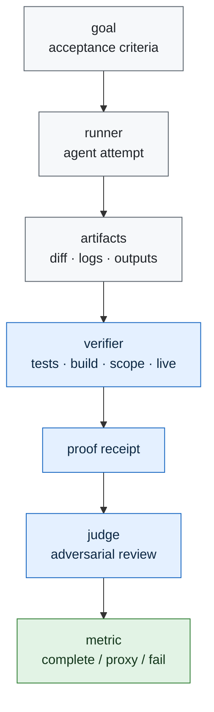

# Architecture

Telos is a protocol for measuring whether an autonomous agent completed the real task. It is not a
replacement for benchmarks. It is a verification layer that can sit around benchmarks whose final
scores are too thin to prove completion quality.

## Core Claim Under Test

Agents can pass a visible proxy while failing the mission:

- tests pass but the acceptance criteria are incomplete,
- the diff changes unrelated behavior,
- the agent hides an unverified production path behind a local check,
- a talk-only turn claims completion without evidence,
- an agent continues editing after the objective is already verified.

The protocol turns those failure modes into explicit receipt fields.

## System Shape

The proof receipt is the unit of evidence. It does not ask a reviewer to trust the model's final
message. It asks the reviewer to inspect the task, the acceptance criteria, the changed artifacts,
and the verification trace.

## Receipt Contract

The schema lives at [`../protocol/proof.schema.json`](../protocol/proof.schema.json). A valid
receipt contains:

- `receipt_id`
- `task_id`
- `agent_id`
- `benchmark_id`
- `status`
- `stated_goal`
- `acceptance_criteria`
- `evidence`
- `falsifiers`
- `sha256`

Evidence kinds are intentionally small:

- `test`
- `typecheck`
- `build`
- `diff_scope`
- `live_check`
- `artifact`
- `adversarial_review`

## Measurement

The first benchmark target will freeze one primary metric. Candidate metrics:

| metric | meaning |
|---|---|
| real completion rate | acceptance criteria met under independent verification |
| proxy pass rate | visible benchmark passes while receipt fails |
| over-edit rate | changed scope exceeds the task need |
| unsupported-claim rate | final answer claims verification without artifact support |
| stop correctness | agent stops after completion instead of continuing to churn |

The exact metric is not chosen until `iter00_target_survey` completes.

## Failure Taxonomy

| failure | receipt signal |
|---|---|
| proxy pass | final benchmark pass, receipt fail |
| hidden gap | required evidence kind missing |
| over-edit | diff-scope evidence fails |
| local-only proof | live check required but absent |
| unverifiable claim | final answer says done; receipt lacks artifacts |
| unnecessary churn | post-completion edits after green verification |

## Aweb Role

Aweb is useful if it supplies governed orchestration, provider routing, receipts, and live-domain
checks. It is not required for every run. If direct scripts are clearer, the experiment uses direct
scripts and records why.

The research repo remains public and reproducible. Aweb can remain the private orchestration layer
only where it adds real evidence.

The current public mission loop is defined in [`MISSION_LOOP.md`](MISSION_LOOP.md) and
[`../mission/loop.json`](../mission/loop.json). It records that Aweb discovery has not yet returned
a callable Telos/Maestro capability slug, so the active loop is GitHub Actions plus committed proof
artifacts. That is a deliberate claim boundary, not a downgrade.
