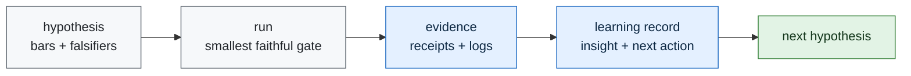

# Learning Engine

Telos learns by turning each experiment into a small durable record:

1. what was tried,
2. whether the gate passed, failed, or blocked,
3. what evidence supports that status,
4. what was learned,
5. what the next action is.

The learning engine is not autonomous scope expansion. It is controlled accumulation. Each record
can move the next gate, but it cannot weaken a frozen bar or invent a benchmark result.

## Loop



## Contract

Learning records live at:

```text
experiments/<id>/proof/learning_record.json
```

They must contain:

- `experiment_id`
- `status`
- `result_path`
- `evidence_paths`
- `insight`
- `next_action`

The validator is:

```bash
python3 scripts/validate_learning_ledger.py
```

## Current Learning State

| experiment | status | insight | next action |
|---|---|---|---|
| `iter01_receipt_dry_run` | pass | receipt validation is independently checkable | freeze first public-task slice |

The next experiment should not spend cloud resources until the public-task slice names the exact
task, expected artifact shape, and falsifier.
