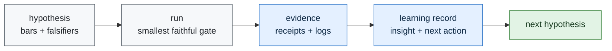

# Learning Engine

Telos learns by turning each experiment into a small durable record:

1. what was tried,
2. whether the gate passed, failed, or blocked,
3. what evidence supports that status,
4. what was learned,
5. what the next action is.

The learning engine is not autonomous scope expansion. It is controlled accumulation. Each record
can move the next gate, but it cannot weaken a frozen bar or invent a benchmark result.

## Loop



## Contract

Learning records live at:

```text
experiments/<id>/proof/learning_record.json
```

They must contain:

- `experiment_id`
- `status`
- `result_path`
- `evidence_paths`
- `insight`
- `next_action`

The validator is:

```bash
python3 scripts/validate_learning_ledger.py
```

## Current Learning State

| experiment | status | insight | next action |
|---|---|---|---|
| `iter01_receipt_dry_run` | pass | receipt validation is independently checkable | freeze first public-task slice |
| `iter02_public_task_slice` | pass | CodeClash-first gives a public, cheap receipt surface | run no-LLM CodeClash smoke |
| `iter03_codeclash_smoke` | pass | CodeClash artifacts and receipts audit cleanly for no-LLM tournament runs | add real agent behavior without provider spend |
| `iter04_agent_behavior_slice` | pass | deterministic Mini-SWE-Agent PvP is the smallest public agent-behavior slice | run deterministic behavior smoke |
| `iter05_agent_behavior_smoke` | pass | deterministic Mini-SWE-Agent trajectory and stats are auditable at zero provider cost | freeze first deterministic edit-agent slice |
| `iter06_deterministic_edit_slice` | pass | a committed CodeClash overlay is the cleanest route to non-empty diff evidence | run deterministic edit smoke |
| `iter07_deterministic_edit_smoke` | pass | non-empty CodeClash Mini-SWE-Agent diffs are auditable at zero provider cost | freeze first provider-model pilot slice |
| `iter08_provider_model_pilot_slice` | pass | local-first Vertex is the only visible paid-provider path with configured infrastructure and no secret leakage | run the frozen provider-model pilot smoke or publish blocked/null evidence |
| `iter09_provider_model_pilot_smoke` | blocked | ADC requires interactive reauthentication, so the paid run correctly stopped before spend | restore secret-safe non-interactive provider authentication |
| `iter10_provider_auth_recovery` | pass | local ADC can now refresh non-interactively without committing credential material | run the frozen Vertex Gemini CodeClash provider smoke retry under the documented $25 ceiling |
| `iter11_provider_model_pilot_retry` | blocked | cloud-runner CodeClash reaches Vertex, but the selected custom-tools model path denies predict permission | recover or replace the selected Vertex model access path before retrying the smoke |
| `iter12_vertex_model_access_recovery` | pass | the dedicated runner identity can reach the selected Vertex custom-tools endpoint through metadata credentials | run the frozen provider smoke retry without widening model or budget scope |
| `iter13_provider_model_pilot_retry_after_access_recovery` | pass | the provider smoke can complete after access recovery, but helper residue remains a diff-quality gap | review the submitted diff quality before treating provider completion as clean evidence |
| `iter14_provider_diff_quality_review` | pass | the provider diff satisfies the local behavior task, and helper files must fail future clean-pass gates | rerun the provider smoke with a strict helper-residue bar |
| `iter15_provider_strict_diff_rerun` | fail | the provider can still complete the smoke while leaving unjustified helper files | test whether workspace-hygiene instructions remove committed helper residue |
| `iter16_provider_workspace_hygiene_control` | pass | scratch-file cleanup can pass the helper-residue bar, but style residue still needs a lint gate | require final diff hygiene before submission |
| `iter17_provider_lint_hygiene_control` | pass | final `git diff --check` prevents whitespace residue in the provider-submitted diff | increase behavior depth while preserving workspace hygiene |
| `iter18_provider_behavior_depth_control` | pass | the provider added source-evident self-collision prevention, but the final status command was incomplete | require a final inspection command immediately before submission |
| `iter19_provider_final_inspection_control` | pass | final `git status --short && git diff --check` produces auditable pre-submit hygiene evidence | verify the submitted behavior semantically from reconstructed artifacts |
| `iter20_behavior_semantic_verification` | pass | reconstructed behavior passes deterministic boundary and self-collision cases locally | add opponent-body collision cases |
| `iter21_opponent_collision_control` | pass | reconstructed behavior passes opponent-body cases, but tails are excluded from the safety claim | prove the semantic suite catches targeted regressions before expanding claims |
| `iter22_semantic_mutation_guard` | pass | targeted mutants for boundary, self-collision, and opponent-collision behavior are detected | test the recorded tail-exclusion caveat directly |
| `iter23_tail_semantics_falsification` | null | under `tail_remains_occupied`, occupied self-tail and opponent-tail moves remain safe while non-tail controls pass | pre-register a tail-safety control or narrow the claim to non-tail body segments |
| `iter24_tail_safety_control` | pass | separating original submitted logic from a changed candidate preserves the tail failure while proving a local occupied-tail control can pass | pre-register a tail-safety mutation guard that catches reintroduced tail-exclusion checks |
| `iter25_tail_safety_mutation_guard` | null | the opponent-tail mutant is detected, but the own-tail mutant still passes because the later snake loop checks our own snake | pre-register an own-tail redundancy mutation guard that removes both own-tail protection paths |
| `iter26_own_tail_redundancy_mutation_guard` | pass | a compound own-tail mutant that removes both direct own-body checking and the self-snake fallback is detected | pre-register a semantic claim-boundary matrix separating original logic, changed candidates, failures, and verifier-strength evidence |
| `iter27_semantic_claim_boundary_matrix` | pass | the semantic evidence chain can be represented as a matrix that keeps original provider logic, changed candidates, failed/null gates, and verifier-strength evidence separate | pre-register a public claim-surface guard that checks README and report prose against the matrix |
| `iter28_public_claim_surface_guard` | pass | README, report, next-phase, and continuity prose can be checked against the claim matrix so nulls and changed-candidate boundaries remain public | pre-register a negative public-claim fixture guard that proves known overclaims are caught |
| `iter29_public_claim_surface_negative_guard` | pass | the public-claim guard catches generated overclaim fixtures while real public prose continues to pass | pre-register a boundary-matrix schema guard so future claim rows remain structurally machine-checkable |
| `iter30_boundary_matrix_schema_guard` | pass | the claim-boundary matrix can be guarded by an explicit local schema validator that rejects malformed rows and hidden failed/null gates | pre-register a release manifest for the claim-boundary evidence chain so reviewers can verify the result packet without guessing artifact scope |
| `iter31_claim_boundary_release_manifest` | pass | a reviewer-facing manifest can tie the claim-boundary matrix, public guards, schema guard, and row evidence into one hash-checked proof packet | pre-register negative fixtures for the release-manifest audit so stale hashes, hidden nulls, and candidate/original conflation are rejected |
| `iter32_claim_boundary_release_manifest_negative_guard` | pass | the release-manifest audit rejects malformed manifest fixtures for stale hashes, hidden failed/null rows, candidate/original conflation, forbidden claims, and missing source artifacts | pre-register a public-sync guard so README, report, next-phase, and continuity prose use the release manifest without bypassing its boundaries |
| `iter33_release_manifest_public_sync_guard` | pass | public prose can be checked against the release manifest so the manifest remains the reviewer entry point and claim boundaries stay visible | pre-register negative public-sync fixtures so prose that hides the release manifest, hides nulls, or conflates original and candidate logic is rejected |
| `iter34_release_manifest_public_sync_negative_guard` | pass | the public-sync guard catches generated public-prose fixtures that bypass the release manifest, hide nulls, conflate candidate/original logic, or add overclaims | pre-register a self-coverage guard so the release-manifest reviewer packet accounts for its own manifest, negative, and public-sync proof gates |

The next experiment must not run CodeClash or call a provider model. It should publish a local
self-coverage guard for the release-manifest reviewer packet.
