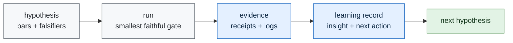

# Learning Engine

Telos learns by turning each experiment into a small durable record:

1. what was tried,
2. whether the gate passed, failed, or blocked,
3. what evidence supports that status,
4. what was learned,
5. what the next action is.

The learning engine is not autonomous scope expansion. It is controlled accumulation. Each record
can move the next gate, but it cannot weaken a frozen bar or invent a benchmark result.

## Loop



## Contract

Learning records live at:

```text
experiments/<id>/proof/learning_record.json
```

They must contain:

- `experiment_id`
- `status`
- `result_path`
- `evidence_paths`
- `insight`
- `next_action`

The validator is:

```bash
python3 scripts/validate_learning_ledger.py
```

## Current Learning State

| experiment | status | insight | next action |
|---|---|---|---|
| `iter01_receipt_dry_run` | pass | receipt validation is independently checkable | freeze first public-task slice |
| `iter02_public_task_slice` | pass | CodeClash-first gives a public, cheap receipt surface | run no-LLM CodeClash smoke |
| `iter03_codeclash_smoke` | pass | CodeClash artifacts and receipts audit cleanly for no-LLM tournament runs | add real agent behavior without provider spend |
| `iter04_agent_behavior_slice` | pass | deterministic Mini-SWE-Agent PvP is the smallest public agent-behavior slice | run deterministic behavior smoke |
| `iter05_agent_behavior_smoke` | pass | deterministic Mini-SWE-Agent trajectory and stats are auditable at zero provider cost | freeze first deterministic edit-agent slice |
| `iter06_deterministic_edit_slice` | pass | a committed CodeClash overlay is the cleanest route to non-empty diff evidence | run deterministic edit smoke |
| `iter07_deterministic_edit_smoke` | pass | non-empty CodeClash Mini-SWE-Agent diffs are auditable at zero provider cost | freeze first provider-model pilot slice |
| `iter08_provider_model_pilot_slice` | pass | local-first Vertex is the only visible paid-provider path with configured infrastructure and no secret leakage | run the frozen provider-model pilot smoke or publish blocked/null evidence |
| `iter09_provider_model_pilot_smoke` | blocked | ADC requires interactive reauthentication, so the paid run correctly stopped before spend | restore secret-safe non-interactive provider authentication |
| `iter10_provider_auth_recovery` | pass | local ADC can now refresh non-interactively without committing credential material | run the frozen Vertex Gemini CodeClash provider smoke retry under the documented $25 ceiling |
| `iter11_provider_model_pilot_retry` | blocked | cloud-runner CodeClash reaches Vertex, but the selected custom-tools model path denies predict permission | recover or replace the selected Vertex model access path before retrying the smoke |
| `iter12_vertex_model_access_recovery` | pass | the dedicated runner identity can reach the selected Vertex custom-tools endpoint through metadata credentials | run the frozen provider smoke retry without widening model or budget scope |
| `iter13_provider_model_pilot_retry_after_access_recovery` | pass | the provider smoke can complete after access recovery, but helper residue remains a diff-quality gap | review the submitted diff quality before treating provider completion as clean evidence |
| `iter14_provider_diff_quality_review` | pass | the provider diff satisfies the local behavior task, and helper files must fail future clean-pass gates | rerun the provider smoke with a strict helper-residue bar |
| `iter15_provider_strict_diff_rerun` | fail | the provider can still complete the smoke while leaving unjustified helper files | test whether workspace-hygiene instructions remove committed helper residue |
| `iter16_provider_workspace_hygiene_control` | pass | scratch-file cleanup can pass the helper-residue bar, but style residue still needs a lint gate | require final diff hygiene before submission |
| `iter17_provider_lint_hygiene_control` | pass | final `git diff --check` prevents whitespace residue in the provider-submitted diff | increase behavior depth while preserving workspace hygiene |
| `iter18_provider_behavior_depth_control` | pass | the provider added source-evident self-collision prevention, but the final status command was incomplete | require a final inspection command immediately before submission |
| `iter19_provider_final_inspection_control` | pass | final `git status --short && git diff --check` produces auditable pre-submit hygiene evidence | verify the submitted behavior semantically from reconstructed artifacts |
| `iter20_behavior_semantic_verification` | pass | reconstructed behavior passes deterministic boundary and self-collision cases locally | add opponent-body collision cases |
| `iter21_opponent_collision_control` | pass | reconstructed behavior passes opponent-body cases, but tails are excluded from the safety claim | prove the semantic suite catches targeted regressions before expanding claims |
| `iter22_semantic_mutation_guard` | pass | targeted mutants for boundary, self-collision, and opponent-collision behavior are detected | test the recorded tail-exclusion caveat directly |
| `iter23_tail_semantics_falsification` | null | under `tail_remains_occupied`, occupied self-tail and opponent-tail moves remain safe while non-tail controls pass | pre-register a tail-safety control or narrow the claim to non-tail body segments |
| `iter24_tail_safety_control` | pass | separating original submitted logic from a changed candidate preserves the tail failure while proving a local occupied-tail control can pass | pre-register a tail-safety mutation guard that catches reintroduced tail-exclusion checks |
| `iter25_tail_safety_mutation_guard` | null | the opponent-tail mutant is detected, but the own-tail mutant still passes because the later snake loop checks our own snake | pre-register an own-tail redundancy mutation guard that removes both own-tail protection paths |
| `iter26_own_tail_redundancy_mutation_guard` | pass | a compound own-tail mutant that removes both direct own-body checking and the self-snake fallback is detected | pre-register a semantic claim-boundary matrix separating original logic, changed candidates, failures, and verifier-strength evidence |
| `iter27_semantic_claim_boundary_matrix` | pass | the semantic evidence chain can be represented as a matrix that keeps original provider logic, changed candidates, failed/null gates, and verifier-strength evidence separate | pre-register a public claim-surface guard that checks README and report prose against the matrix |
| `iter28_public_claim_surface_guard` | pass | README, report, next-phase, and continuity prose can be checked against the claim matrix so nulls and changed-candidate boundaries remain public | pre-register a negative public-claim fixture guard that proves known overclaims are caught |
| `iter29_public_claim_surface_negative_guard` | pass | the public-claim guard catches generated overclaim fixtures while real public prose continues to pass | pre-register a boundary-matrix schema guard so future claim rows remain structurally machine-checkable |
| `iter30_boundary_matrix_schema_guard` | pass | the claim-boundary matrix can be guarded by an explicit local schema validator that rejects malformed rows and hidden failed/null gates | pre-register a release manifest for the claim-boundary evidence chain so reviewers can verify the result packet without guessing artifact scope |
| `iter31_claim_boundary_release_manifest` | pass | a reviewer-facing manifest can tie the claim-boundary matrix, public guards, schema guard, and row evidence into one hash-checked proof packet | pre-register negative fixtures for the release-manifest audit so stale hashes, hidden nulls, and candidate/original conflation are rejected |
| `iter32_claim_boundary_release_manifest_negative_guard` | pass | the release-manifest audit rejects malformed manifest fixtures for stale hashes, hidden failed/null rows, candidate/original conflation, forbidden claims, and missing source artifacts | pre-register a public-sync guard so README, report, next-phase, and continuity prose use the release manifest without bypassing its boundaries |
| `iter33_release_manifest_public_sync_guard` | pass | public prose can be checked against the release manifest so the manifest remains the reviewer entry point and claim boundaries stay visible | pre-register negative public-sync fixtures so prose that hides the release manifest, hides nulls, or conflates original and candidate logic is rejected |
| `iter34_release_manifest_public_sync_negative_guard` | pass | the public-sync guard catches generated public-prose fixtures that bypass the release manifest, hide nulls, conflate candidate/original logic, or add overclaims | pre-register a self-coverage guard so the release-manifest reviewer packet accounts for its own manifest, negative, and public-sync proof gates |
| `iter35_release_manifest_self_coverage_guard` | pass | a self-coverage report can account for the release-manifest reviewer packet's own manifest, negative, public-sync, and public-sync-negative proof gates without rewriting prior evidence | pre-register negative self-coverage fixtures so missing, stale, or hidden self-verification artifacts are rejected |
| `iter36_release_manifest_self_coverage_negative_guard` | pass | the self-coverage guard rejects malformed reports that remove self-verification gates, stale hashes, hide failed/null gates, conflate candidate/original logic, or add forbidden benchmark claims | pre-register a public-sync guard so README, report, next-phase, and continuity prose surface the self-coverage report without bypassing claim boundaries |
| `iter37_release_manifest_self_coverage_public_sync_guard` | pass | public prose can surface the self-coverage report and negative guard while keeping the release manifest as the claim-boundary reviewer entry point | pre-register negative public-sync fixtures so prose that hides self-coverage or bypasses the release manifest is rejected |
| `iter38_release_manifest_self_coverage_public_sync_negative_guard` | pass | the self-coverage public-sync guard catches malformed prose that hides the release manifest, hides self-coverage evidence, hides failed/null gates, conflates changed candidate logic with original provider logic, or adds forbidden claims | pre-register a public-task protocol-effect slice so baseline and Telos-enforced completion evidence can be compared on frozen external tasks |
| `iter39_public_task_protocol_effect_slice` | pass | a public task protocol-effect slice can be frozen before execution with exact task identifiers, baseline and Telos-enforced conditions, before-data metrics, and a bounded provider execution gate | execute the frozen protocol-effect slice only under the recorded provider, cost, artifact, and claim-boundary controls |
| `iter40_public_task_protocol_effect_execution` | blocked | the frozen protocol-effect slice could not honestly execute because runner readiness was not established before provider spend | recover Docker and pinned CodeClash runner readiness before retrying the frozen protocol-effect execution |
| `iter41_public_task_protocol_effect_runner_recovery` | pass | local Docker remained unavailable, but the isolated GitHub Actions path proves runner readiness for all three frozen CodeClash surfaces at zero provider spend | retry the frozen protocol-effect execution only under the isolated-runner, provider, cost, artifact, and claim-boundary controls |
| `iter42_public_task_protocol_effect_execution_retry` | blocked | runner readiness is recovered, but provider-backed execution still needs a committed harness with cost capture, artifact retention, redaction, and runner lifecycle proof before paid task-condition pairs can start | recover the provider execution harness before retrying the frozen protocol-effect execution slice |
| `iter43_provider_execution_harness_recovery` | pass | a separate non-GPU Telos runner lifecycle probe can create and delete its own VM while the committed harness validates cost parsing, artifact retention, and redaction without model calls or full task-condition execution | retry the frozen protocol-effect execution under the recovered provider harness and unchanged provider, cost, artifact, and claim-boundary controls |
| `iter44_public_task_protocol_effect_execution_after_harness_recovery` | blocked | harness recovery is not the same as six-pair protocol-effect execution; the recovered harness still disables full task-condition execution and requires an executor-assembly gate | assemble and dry-run the public task-condition executor before retrying provider-backed protocol-effect execution |
| `iter45_public_task_condition_executor_assembly` | pass | the frozen public task-condition slice can be represented as six audited dry-run pairs with artifact, cost, redaction, lifecycle, receipt, and metric plans before provider execution | run the pre-registered provider-backed six-pair protocol-effect execution using the assembled executor and publish exact counts, costs, raw artifacts, receipts, and nulls |
| `iter46_public_task_protocol_effect_execution_with_assembled_executor` | blocked | the dry-run executor manifest is not yet a provider-backed executor; provider overlays must be bound into exact task-condition commands before paid execution can start | recover provider task-condition command binding without spend, then retry the six-pair execution only if the command surface is concrete and audited |
| `iter47_provider_task_condition_command_binding_recovery` | blocked | the existing Vertex provider overlay binds only the BattleSnake PvP surface; Dummy and deterministic-edit pairs must be narrowed or get new provider overlays before paid execution | pre-register a provider-compatible protocol-effect slice refreeze before any provider-backed execution retry |
| `iter48_provider_compatible_protocol_effect_slice_refreeze` | pass | the next honest provider-compatible execution slice is the two-pair BattleSnake PvP baseline/Telos comparison; four historical pairs remain excluded until compatible overlays exist | run the bounded provider-compatible execution retry only for the two selected BattleSnake pairs under the frozen budget and claim boundary |
| `iter49_provider_compatible_protocol_effect_execution_retry` | blocked | the two-pair provider-compatible slice is ready, but paid execution must still block until a committed wrapper can run exactly those pairs and preserve cost, raw artifact, receipt, redaction, and lifecycle evidence | recover a zero-spend provider-compatible execution wrapper before retrying the two-pair provider run |
| `iter50_provider_compatible_execution_wrapper_recovery` | pass | a committed zero-spend wrapper can dry-run exactly the two provider-compatible BattleSnake pair plans and reject all four excluded historical pairs | run the bounded two-pair provider execution retry only under the wrapper, frozen budget, raw-artifact, receipt, redaction, lifecycle, and claim-boundary controls |
| `iter51_provider_compatible_protocol_effect_execution_with_wrapper` | blocked | the wrapper is still dry-run-only and the Telos row is not a distinct runtime condition from baseline, so a paid run would not produce strong protocol-effect evidence | recover a condition-separated provider wrapper with explicit execution mode before any paid two-pair protocol-effect retry |
| `iter52_provider_condition_runtime_separation_recovery` | pass | the provider-compatible retry now has distinct baseline and Telos runtime commands, overlays, prompts, and a Telos receipt-validation path before acceptance, while execution remains disabled by default | run only the bounded two-row paid provider-compatible pilot under the recovered condition-separated plan and frozen claim boundary |
| `iter53_provider_compatible_protocol_effect_execution_after_condition_recovery` | blocked | condition separation is ready, but paid provider-compatible execution still needs a committed pair executor plus pinned CodeClash and Docker runner readiness before model calls can start | recover a zero-spend provider pair executor before retrying the two-row paid pilot |

The next experiment may recover only the executor machinery needed for the two selected
provider-compatible BattleSnake rows. Provider calls, provider spend, excluded-pair execution, GPU
use, Sentinel resource modification, production/live-domain changes, and unsupported
benchmark/model claims remain forbidden.
