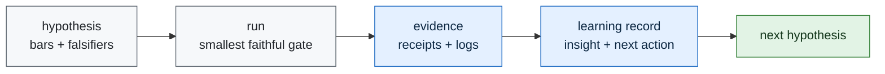

# Learning Engine

Telos learns by turning each experiment into a small durable record:

1. what was tried,
2. whether the gate passed, failed, or blocked,
3. what evidence supports that status,
4. what was learned,
5. what the next action is.

The learning engine is not autonomous scope expansion. It is controlled accumulation. Each record
can move the next gate, but it cannot weaken a frozen bar or invent a benchmark result.

## Loop



## Contract

Learning records live at:

```text
experiments/<id>/proof/learning_record.json
```

They must contain:

- `experiment_id`
- `status`
- `result_path`
- `evidence_paths`
- `insight`
- `next_action`

The validator is:

```bash
python3 scripts/validate_learning_ledger.py
```

## Current Learning State

| experiment | status | insight | next action |
|---|---|---|---|
| `iter01_receipt_dry_run` | pass | receipt validation is independently checkable | freeze first public-task slice |
| `iter02_public_task_slice` | pass | CodeClash-first gives a public, cheap receipt surface | run no-LLM CodeClash smoke |
| `iter03_codeclash_smoke` | pass | CodeClash artifacts and receipts audit cleanly for no-LLM tournament runs | add real agent behavior without provider spend |
| `iter04_agent_behavior_slice` | pass | deterministic Mini-SWE-Agent PvP is the smallest public agent-behavior slice | run deterministic behavior smoke |
| `iter05_agent_behavior_smoke` | pass | deterministic Mini-SWE-Agent trajectory and stats are auditable at zero provider cost | freeze first deterministic edit-agent slice |
| `iter06_deterministic_edit_slice` | pass | a committed CodeClash overlay is the cleanest route to non-empty diff evidence | run deterministic edit smoke |
| `iter07_deterministic_edit_smoke` | pass | non-empty CodeClash Mini-SWE-Agent diffs are auditable at zero provider cost | freeze first provider-model pilot slice |
| `iter08_provider_model_pilot_slice` | pass | local-first Vertex is the only visible paid-provider path with configured infrastructure and no secret leakage | run the frozen provider-model pilot smoke or publish blocked/null evidence |
| `iter09_provider_model_pilot_smoke` | blocked | ADC requires interactive reauthentication, so the paid run correctly stopped before spend | restore secret-safe non-interactive provider authentication |

The next experiment should not call a model. It should restore non-interactive provider
authentication or publish blocked/null evidence.
