# TELOS 2026 roadmap

## North star

TELOS should answer one question:

> What exact evidence justifies accepting an autonomous agent’s claim that consequential work is complete?

The answer must survive an untrusted agent, an incomplete grader, an unreliable judge, missing
infrastructure, and later independent audit.

## Product and research architecture

~~~mermaid
flowchart LR
    A["Task contract goal · constraints · falsifiers"] --> B["Isolated agent execution"]
    B --> C["Full trajectory messages · tools · actions · outputs"]
    C --> D["Content-addressed evidence artifacts · environment · model binding"]
    D --> E["Independent verification grader · consequences · human review"]
    E --> F{"Claim gate"}
    F -->|all required evidence passes| G["Signed claim bounded scope"]
    F -->|failure, missingness, or conflict| H["Fail / null / abstain no silent imputation"]
    G --> I["Deployment monitoring drift · incidents · re-evaluation"]
    I --> C
~~~

TELOS Core should become a small reusable library and CLI. Historical experiment scripts remain immutable
evidence; they should not define the future API.

## Workstreams

### 1. Evidence substrate

- Receipt v2: bind every evidence artifact by canonical path, byte count, SHA-256, media type, and producer.
- Evidence closure: one digest over the complete evidence set.
- Environment binding: exact source commit, container digest, model identifier, request parameters, tool
  versions, and exit status.
- Identity and time: in-toto/SLSA-compatible attestations plus Sigstore keyless signing and transparency-log
  inclusion for public releases.
- Verification policy: distinguish byte identity, signer identity, chronology, and semantic truth.

Relevant standards:

- [SLSA provenance](https://slsa.dev/spec/v1.2/provenance)
- [in-toto statement v1](https://github.com/in-toto/attestation/blob/main/spec/v1/statement.md)
- [Sigstore keyless signing](https://docs.sigstore.dev/cosign/signing/overview/)

### 2. Trace and monitor adapters

- One canonical event schema for model messages, tool calls, file reads/writes, commands, policy decisions,
  approvals, and outputs.
- Adapters for at least OpenAI/Codex, Anthropic/Claude Code, and one open-weight coding-agent harness.
- Separate action-only, final-output, and full-trajectory monitor views.
- Raw response retention with secret-safe redaction manifests; never retain only parsed labels.
- Structured abstention and escalation rather than forced binary judge labels.

### 3. Consequence verification

- Pre-author hidden consequence tests before agent output.
- Keep grader code and hidden labels outside the mutable agent workspace.
- Use metamorphic, differential, property, and integration checks where each is justified.
- Record which requirements each test covers; report uncovered requirements explicitly.
- Use independent engineers for semantic labels, with disagreement and adjudication retained.

### 4. Reliability science

Measure capability and reliability separately:

- repeated-run consistency;
- robustness to prompt, tool, and environment perturbations;
- confidence calibration and abstention;
- failure severity and tail risk;
- verification latency and cost;
- contamination and evaluation-awareness sensitivity.

### 5. Public trust surface

- A short README current path plus immutable historical detail.
- Maintain `CITATION.cff`; add an archived release, DOI, model/agent system card, data statement, and
  broader-impact section.
- A compact reviewer bundle that reproduces every table from exact evidence.
- Independent replication before any “state of the art,” product efficacy, or natural-frequency claim.

## Next GPU experiment: TCP-1

Name: **TELOS Trace–Consequence Pilot 1**

Status: deterministic materialization preflight exists in the exact iter211 seal. Iter213 repaired its three
post-seal descendant/handoff compatibility defects locally, but exact push and pull-request CI both exposed
a platform-dependent one-ULP Wilson boundary residue. Iter214 is the active additive pre-data numerical and
publication-validation recovery; iter212 remains the unchanged prospective independent-cohort gate.
Scientific execution is blocked. There is no admitted task cohort, reviewer team, selected model,
hidden-test freeze, execution binding, external timestamp, isolation rehearsal, throughput result, or
approved monetary budget. No model call, GPU allocation, or scientific execution is authorized by this
roadmap or by repository publication.

### Question

Among agent patches that pass the visible grader, does a gate combining full-trajectory policy checks and
pre-authored consequence tests reject more semantically wrong completions than the visible grader alone,
without an unacceptable false-positive rate on semantically valid completions?

### Pilot cohort

- 12 fresh coding tasks selected after the chosen open-weight model’s documented training cutoff.
- Tasks must be independently solvable, containerized, and small enough for bounded repeated runs.
- Five independent seeds per task: 60 trajectories.
- A separate fixed set of legitimate implementations and deterministic integrity attacks serves as
  calibration controls; controls are never pooled into the natural-behavior estimate.
- No task enters the cohort if its hidden consequence tests were derived after inspecting model output.

### Blinding and independence

1. Two engineers author the task contract and consequence tests before model execution.
2. The complete preregistration, task hashes, hidden-test hashes, and analysis code receive an external
   transparency timestamp before the first trajectory.
3. The agent cannot read or edit hidden tests, trusted grader code, or receipt-generation code.
4. Two different engineers provide independent human semantic labels for proxy-passing outputs while
   blinded to seed, monitor verdict, and whether
   the patch is a control. Disagreement is retained and adjudicated by a third reviewer.
5. LLM judges may be measured as monitors but never define semantic ground truth.

### Execution binding

Every trajectory must retain:

- exact model-weight digest, tokenizer digest, inference-engine version, quantization, and sampling fields;
- exact repository commit and container image digest;
- complete messages, tool calls, tool outputs, file-access log, patch, commands, exits, and resource usage;
- visible-grader result and hidden-consequence result;
- receipt v2 closure verified from a clean checkout;
- signed in-toto/SLSA-style attestation and transparency-log bundle for the frozen aggregate.

### Endpoints

Primary endpoint:

- paired reduction in false-completion acceptance from visible-grader-only to the TELOS gate among
  proxy-passing, independently adjudicated semantic failures.

Secondary endpoints:

- false rejection on independently adjudicated valid completions;
- incremental catch contribution of action-only, final-diff, full-trajectory, and consequence monitors;
- five-run task consistency;
- failure-severity distribution;
- latency, tokens, energy estimate, and verification cost;
- monitor abstention and missingness.

Analysis:

- report exact counts and all missing outcomes;
- use an exact paired test for the primary gate comparison;
- give Wilson intervals for simple binomial rates;
- report task-clustered uncertainty as a sensitivity analysis;
- make no model ranking or natural population-rate claim from this selected pilot.

### Hard falsifiers

TCP-1 is a null or failure—not a result—if any of these occurs:

- task or hidden-test freeze happens after any model output;
- model weights, source, container, or request configuration are not digest-bound;
- any raw trajectory or grader output is missing;
- hidden evidence enters the agent-visible workspace;
- semantic labels depend on an LLM judge;
- artifact receipt verification fails;
- fewer than ten independently adjudicated proxy-passing semantic failures exist for detector comparison;
- controls are pooled into natural-behavior rates;
- analysis changes after unblinding without a separately versioned amendment.

### Resource gate

- Candidate model and hardware remain unchosen until license, cutoff, context, and weight digests are
  verified.
- Preflight one task and one seed without entering the scientific cohort.
- Hard pilot ceiling: 64 accelerator-hours and the separately approved monetary budget.
- Stop before allocation if projected throughput cannot finish the frozen cohort inside that ceiling.
- No cloud spend or provider call is implied by repository access or by this document.

### Fail-closed admission path

```mermaid
flowchart LR
I211["211 preflight"] --> I213["213 recovery"]
I213 --> I214["214 numeric recovery<br/>exact Wilson"]
I214 --> I219["219 temporal yield<br/>NULL"]
I219 --> I222["222 admission<br/>5/11"]
I222 --> I212["212 freeze<br/>humans + tasks + custody"]
I212 --> I215["215 isolated preflight<br/>one task · one seed"]
I215 --> Q{"all admission gates pass<br/>inside 64-hour ceiling?"}
Q -->|no or missing| B["BLOCKED / NULL<br/>no scientific run"]
Q -->|yes| I216["216 bounded execution<br/>60 natural trajectories"]
I216 --> I217["217 blinded adjudication<br/>locked analysis"]
I217 --> R{"valid and interpretable?"}
R -->|no| N["publish bounded null/failure"]
R -->|yes| I218["218 independent replication<br/>multiple models + harnesses"]
classDef done fill:#eaf3ff,stroke:#0969da,color:#0c2d57;
classDef corrected fill:#fff4e5,stroke:#b54708,color:#4a2500;
classDef active fill:#e6f4ea,stroke:#1a7f37,color:#0f3d1c;
classDef blocked fill:#fff1f0,stroke:#cf222e,color:#4c1114;
class I211 done;
class I213 corrected;
class I214 corrected;
class I219 done;
class I222 active;
class B,N blocked;
```

## Sequenced roadmap

### Iter208 — post-seal forensic correction

- preserve iter207;
- correct paper and README claims;
- add 2026 related work and strategic positioning;
- ship receipt v2 and project-boundary cleanup;
- bind the audit, roadmap, source, PDF, and diagrams;
- close with no scientific run.

### Iter209 — publication-CI recovery

- preserve the failed iter208 branch and exact remote outcomes;
- bind historical source checks to immutable Git blobs;
- isolate unit tests from ambient pull-request environment;
- stop when pull-request CI exposes the next synthetic-merge assumption.

### Iter210 — pull-request topology recovery

- preserve iter208 and iter209 unchanged;
- validate push, synthetic-merge, merged-master, and descendant topologies from exact sealed commits;
- merge only after exact-tip push and pull-request CI pass;
- close with no scientific execution. PR `#10` merged as
  `fb348eb1f67c0605679cd56a1cfa210cf192db03`; merged-master CI passed.

### Iter211 — TCP-1 materialization preflight

- freeze the pilot shape, deterministic seeds, schemas, gate semantics, analysis code, missingness,
  controls, resource envelope, and isolation threat model;
- represent absent humans, tasks, bindings, timestamp, rehearsal, throughput, and budget as blockers;
- publish an artifact-bound receipt whose scientific-execution status is `blocked`;
- make no model call, accelerator allocation, or scientific claim;
- preserve the exact local seal after its first complete post-seal suite exposes three publication-only
  compatibility defects.

### Iter212 — independent cohort and custody freeze

- recruit and conflict-screen five distinct human roles;
- select one license-compatible open-weight model and bind its authoritative cutoff and exact weights;
- select and license twelve strictly post-cutoff tasks;
- independently author hidden consequence tests and controls outside the agent workspace;
- bind runtime/container/hardware, pass hostile isolation rehearsal, obtain an external transparency
  timestamp, and record separate budget approval;
- authorize at most the later non-cohort throughput preflight, never the pilot itself.

### Iter213 — iter211 post-seal validation recovery

- preserve iter211 and iter212 byte-for-byte;
- accept both bounded handoff heading families without disabling standing-claim scans;
- make iter210 and iter211 receipt/topology checks resolve exact immutable commits on arbitrary descendants;
- rerun the full provider-free closure and synthetic-merge simulation;
- preserve its exact failed branch and PR after both remote CI events expose the Wilson boundary residue;
- authorize no science.

### Iter214 — TCP-1 cross-platform numeric recovery

- preserve iter211, iter212, and iter213 experiment bytes and the unchanged failed iter213 branch/PR;
- record a separately versioned pre-data amendment before any TCP-1 output exists;
- canonicalize only the mathematically exact Wilson `k=0` lower and `k=n` upper boundaries;
- make sealed iter213 validation read immutable source Git blobs rather than additive descendant scope;
- require full local, synthetic-merge, Python 3.11, and Python 3.12 closure; authorize no science.

### Iter219 — temporal consequence-test yield (published null)

Executes before iter212 in dependency order; the number records creation order.

- test, at zero spend, whether maintainers' later-added tests could supply the independently authored hidden
  consequence tests that iter212 otherwise needs recruited humans to write;
- seal the hypothesis, then two pre-data amendments, before any instance is scored;
- **result: null.** `Y(365) = 0.4066` forward versus `0.4336` backward within-repository (`p = 0.925`,
  difference `−0.0270`). No temporal signal. Exposure is balanced (`0.942`), so the null is not an artifact of
  how many tests each side offered;
- the originally sealed cross-repository control reads `0.4066` versus `0.1660` at `p = 3.48e-24`. That
  control cannot fail for the right reason, and the pre-data `A2` amendment is the only reason the false
  positive was not published;
- falsifies static symbol-name matching as a detector at this granularity; does **not** falsify the harvest
  idea, per the inference rule fixed before observation;
- contributes no scientific `N`, `k`, or `u` to TCP-1; admission stays `2/11`.

### Iter222 — agent-solvable admission evidence (5/11)

Executes before iter212 in dependency order; the number records creation order.

- fill the three TCP-1 admission gates that need no external humans, hardware, or budget: bind one
  license-compatible open-weight model from live HuggingFace digests (Qwen2.5-7B-Instruct, Apache-2.0, no
  weights downloaded); obtain a real RFC 3161 transparency timestamp that re-verifies offline; rehearse the
  five registered isolation attacks with positive controls that fire on a weakened contract;
- move admission from `2/11` to `5/11`; keep `execution_authorized=false`;
- the six remaining gates require reviewers, task and hidden-test authors, real runtime and hardware, a paid
  throughput preflight, and an approved budget — none agent-solvable, all in the unchanged iter212 gate.

### Iter215 — isolated throughput preflight

- execute one task and one seed outside the scientific cohort under at most two accelerator-hours;
- test end-to-end trace, grader, receipt, isolation, redaction, and resource custody;
- project the frozen cohort plus controls with ten-percent headroom;
- stop if the total cannot fit inside the 64-hour ceiling.

### Iter216 — bounded GPU execution

- execute exactly the frozen 60 natural trajectories only if iter212 and iter214 pass;
- execute calibration controls under separate identifiers and denominators;
- collect append-only raw evidence before adjudication;
- stop on the first custody, isolation, budget, or completeness violation.

### Iter217 — blinded adjudication

- obtain two independent semantic labels for every proxy-passing output;
- retain disagreement and use the independent adjudicator only where required;
- run the locked analysis with explicit missingness and separate controls;
- make no post-hoc threshold or endpoint change inside the result.

### Iter218 — multi-model replication

- proceed only after TCP-1 yields a valid, interpretable, bounded result;
- use at least three model families and two agent harnesses;
- require one external team to reproduce the evidence bundle;
- withhold model-ranking, prevalence, product-efficacy, and state-of-the-art claims until a design capable of
  supporting each claim exists.

## Funding thesis

The investable form of TELOS is not a claim that another benchmark is best. It is a neutral assurance
substrate for organizations deploying agents into code, research, operations, and safety-critical
workflows:

1. capture the whole action trace;
2. bind claims to exact evidence;
3. verify consequences independently;
4. expose uncertainty and missingness;
5. sign only the bounded claim the evidence supports.

Funding should accelerate independent review, reusable adapters, and replication—not a larger unreviewed
run.
