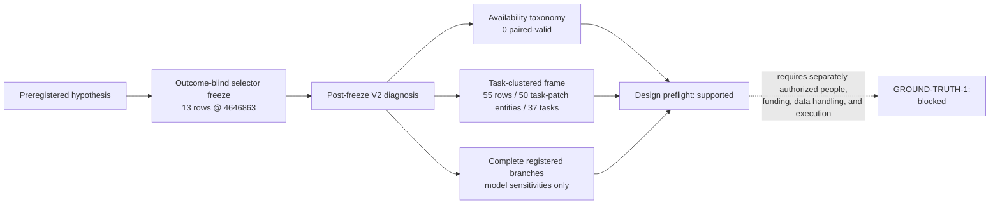

# Iter240 result — ground-truth admission design and missingness freeze

Status: **design evidence complete; independent ground truth remains
blocked.** This is a retrospective reconstruction plus a prospective protocol
freeze. It is not a detector result, population estimate, recovered outcome,
cohort authorization, or human adjudication.

The exact hypothesis was committed before the builder, census, diagnostic
artifacts, role policy, decision curves, and this result. The selector was then
closed as a separate transaction at commit
`46468639088509c65ab06af5d839b7d3a52722b5`: its retained census and receipt
bind the selector bytes and only the two candidate tables it was permitted to
read. The iter240 materialization pass first read diagnostic scenario,
execution, and judge evidence after that commit. Those committed artifacts and
the five historical scenario outcomes had already been inspected before the
preregistration, as its retrospective disclosure records.

## Registered status fields

design_preflight: **supported**

retained_evidence_recovery: **blocked**

independent_ground_truth: **blocked**

cohort_acquisition: **not_authorized**

The design-preflight status means that the frozen repository bytes regenerate
the registered census, taxonomy, task-clustered frame, role-view controls, and
all retained registered branches and disclosed model sensitivities. It changes
none of `k=0,N=37,u=13` and does not make the fresh-cohort comparison
supported.

The five `*_v2.json` artifacts are the only post-freeze diagnostic authority.
The unversioned V1 diagnostic outputs are intentionally absent and rejected:
they did not pin the temporal selection commit, represented unmeasured arms as
false, and lacked independent field reconstruction.



## Outcome-blind missingness census

The strict selector reads exactly three typed predicates:

```text
certified_resolved is true
AND gold_equivalent_after_terminal_lf_normalization is false
AND outcome_complete is false
```

It returns thirteen distinct task identities: six from iter224 and seven from
iter228. Integer stand-ins for booleans fail. The active selector is
structurally rejected if it reads status, divergence, results, scenarios,
logs, labels, or judge evidence.

The selection receipt binds two predecessor blobs at merged iter239 commit
`b597b763f2eb52b2f4f2d36e7daaa31654be076b`. The post-freeze materialization
receipt binds 163 named regular predecessor blobs. Every source worktree byte
must equal its predecessor Git blob; missing, symlinked, untracked, changed,
duplicate-key, or non-finite JSON evidence fails closed.

## Retained-evidence availability

The diagnostic pass reproduces the disclosed availability taxonomy:

| Availability state | Rows |
| --- | ---: |
| `excluded_unsafe` | 7 |
| `no_scenario` | 1 |
| `paired_invalid_both_arms` | 3 |
| `paired_invalid_candidate_only` | 2 |
| paired valid | 0 |
| retained blind verdict | 0 |

The two candidate-only failures have a valid accepted arm and an invalid
candidate arm. An exception is not a recovered differential. The three
both-arm failures are also not outcomes. Unsafe and no-scenario rows were not
executed or relaxed. Across the twenty-six possible arm evaluations, sixteen
are therefore `valid: null` with `validity_state: not_evaluated`, not false.

Post-freeze diagnostic state is exposed for all thirteen rows. Historical
scenario outcomes exist for exactly five rows and had already been exposed
before the gate was preregistered; the other eight rows do not acquire an
outcome by being inspected. The five exposed outcomes are diagnostic only and
are forbidden as a future primary endpoint. Consequently, retained-evidence
recovery is blocked and all thirteen rows remain missing.

## Task-clustered future frame

The acquisition inventory contains:

| Operational stratum | Candidate rows | Unique task-patch entities | Unique tasks |
| --- | ---: | ---: | ---: |
| operational positives | 17 | 17 | 12 |
| hard controls | 25 | 21 | 14 |
| fresh missing | 13 | 13 | 13 |
| total | 55 | 50 | 37 |

`django__django-11964` and `pydata__xarray-7233` occur in both the positive and
hard-control strata. Five `(task identity, candidate-patch bytes)` groups are
duplicated across operational provenance rows. One exact candidate patch for
`pydata__xarray-7233` occurs in both the positive and hard-control strata.
These are retained disagreements in operational provenance, not extra
candidates or independent evidence.

The future semantic-review unit is one unique task identity plus one unique
candidate-patch byte sequence. Duplicate provenance rows must share one
candidate packet; row-level witnesses remain available for discordance
analysis. The task identity remains the inferential cluster. Iter240 does not
choose the later one-endpoint-per-task aggregation rule, so detector power and
population inference remain blocked.

The positive and control labels retain their operational provenance. Every
frame row has `independent_semantic_label: null`.

## Decision grids

All fourteen missingness assignments, `x=0..13`, are retained. The registered
boolean is evaluated as the exact rate comparison `29*x < 185`; the fresh
operational rate is strictly below `5/29` only for `x=0..6`. It is not a
concentration result. The exploratory Fisher calculation uses the frozen
table `[[x,37-x],[5,24]]`, the
`fresh_less_than_reused` alternative, and exact rational arithmetic. No branch
is selected as the result.

The zero-event grid is a binomial-model sensitivity, not an empirical bound on
the current cohorts. It assumes independent Bernoulli task endpoints sharing
one event probability and exactly one completed, independently adjudicated
endpoint per unique task. Under those assumptions, the one-sided
Clopper-Pearson 95% grid covers every `n=1..500`. Its first threshold crossings
are:

| Upper-bound target | First qualifying `n` |
| --- | ---: |
| 10% | 29 |
| 5% | 59 |
| 2% | 149 |
| 1% | 299 |

The retained decimal displays are generated with a platform-independent
high-precision decimal algorithm and validated by tolerance plus exact
threshold inequalities. No gate compares a libm-derived float bit for bit.
The current convenience cohorts do not satisfy the prerequisites for
population inference, and the grid is not linked to acquisition planning
until a task-endpoint aggregation rule and all completion and validity yields
are prospectively frozen.

Acquisition planning uses `37/64`: thirty-seven certified patches from
sixty-four purchased solve attempts. The separate `37/62` figure is
conditional on a solution-producing patch and is explicitly forbidden as the
acquisition-yield input. All sixty-four attempted task identities and all
thirty-seven certified task identities are unique, the two source cohorts are
disjoint, and every certified identity belongs to the attempted set.

For any fixed point yield `0 < y <= 1`, the symbolic planning rule is
`ceil(target / y)`: the minimum integer attempt count whose **expected**
certified count reaches the target. A zero yield makes every positive target
unattainable. The retained seven rational yield points are a disclosed
post-hypothesis illustrative grid, not a preregistered or complete domain.
At the retrospective `37/64` point observation, the expectation thresholds
are `51`, `103`, `258`, and `518` attempts. They are not requirements,
probability guarantees, stable yield estimates, independent-label counts,
power calculations, or purchase authority. They do not model yield
uncertainty, cohort shift, adjudication completion, or semantic-label yield,
and they are not connected to the zero-event grid.

Paired detector-power calculation remains blocked until a later execution
measures supported-label yield, consequence validity, adjudication completion,
within-task discordance, control false-rejection behavior, and prospectively
freezes the task-endpoint aggregation rule and uncertainty model.

## Prospective role and leakage contract

The design defines eight least-privilege views over fifty-two classified
fields: consequence author, independent implementation producer,
independence registrar, outcome-masking broker, two primary semantic
adjudicators, disagreement adjudicator, and deidentified analyst.

No person is assigned in iter240. Consequence authors cannot see candidate or
accepted patches, prior outcomes, labels, provenance, solver/provider
identities, or judge output. Primary adjudicators cannot see slot mappings,
source roles, or peer verdicts before their own locks. A third adjudicator
first locks an independent view before any identity-free disagreement
material is released. Missing review, timeout, abstention, conflict, or retry
exhaustion never implies approval.

The future broker contract permits at most three frozen attempts and selects
the first paired-valid attempt in frozen order regardless of whether results
are equal or different. Invalid attempts never relax safety. This is a schema
and rejection policy only: no packet, person, attempt, consequence, or
execution was created.

Future packet identifiers must be broker-issued 256-bit CSPRNG tokens allocated
before candidate, task, stratum, source, or digest mapping. The internal
content-derived `candidate_row_id` is never role-visible and cannot be reused
or hashed into a packet identifier. Token shape alone cannot prove entropy,
issuer, or chronology, so future materialization also requires a broker
issuance receipt and the complete forbidden-linkage corpus.

## Negative controls and validation

The retained adversarial fixtures reject, among other cases:

- twelve, fourteen, duplicate, or truthiness-selected missing rows;
- selectors that read status or use permissive mapping access;
- changed predecessor bytes;
- candidate-only exceptions and missing or duplicate results;
- repeated-task inflation and pooled strata;
- the `37/62` denominator substituted for `37/64`;
- missing Fisher branches and reversed numerical boundaries;
- bit-exact libm comparisons;
- patch, label, outcome, model, provider, judge, slot, identity, filename,
  digest, Unicode-alias, and nested-field leakage;
- self-review, model or owner authority, incompatible role assignments,
  missing-review approval, outcome-selected attempts, and safety relaxation;
  and
- design completion represented as execution, acquisition, or spending
  authority.

The independent diagnostic validator reconstructs fields without importing
the builder. Its closed mutation dispatcher executes every registered
diagnostic known-bad case against the production validation path; the separate
role guard executes its own 58-fixture catalogue.

## Reproduce the retained boundary

From the repository root:

```bash
python3 scripts/build_iter240_ground_truth_admission.py --check-selection
python3 scripts/build_iter240_ground_truth_diagnostics.py --check
python3 scripts/validate_iter240_ground_truth_diagnostics.py
python3 scripts/validate_iter240_role_view_policy.py
python3 -m pytest -q \
  tests/test_iter240_ground_truth_diagnostics.py \
  tests/test_iter240_role_view_policy.py \
  tests/test_iter240_ci_entrypoints.py
```

## Action accounting and remaining boundary

This gate used `$0.00` external spend, zero provider or model calls, zero
scientific containers, zero target executions, zero GPU allocations, zero
human contacts, zero new solves, and zero adjudications.

Telos still lacks independent semantic ground truth, validated detector
efficacy, a task-population estimate, fix-size transfer evidence, and
independent review. GROUND-TRUTH-1 remains blocked on separately authorized
funding, actual conflict-screened humans, data handling, and execution.

At this retained-result boundary, the completed-evidence commit, exact-tree
successor seal, exact sealed-head CI, two-parent merge, merged-master CI, and
final read-only post-merge observation remain separate engineering closure
steps. None can upgrade the scientific statuses above.
